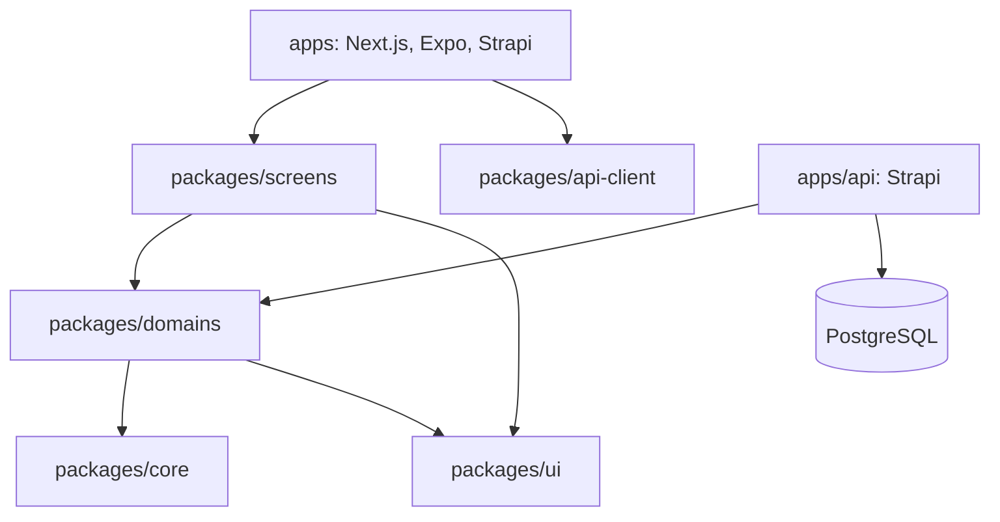

# Architecture Spine - Agora Starter Pack V1

## Design Paradigm

Monolithe modulaire hexagonal dans un monorepo a shells de runtime.

Les noms de domaines et parcours presentes dans les exemples sont illustratifs; ce starter pack ne prescrit aucun modele metier.



## Invariants & Rules

### AD-1 - Direction des dependances [ADOPTED]

- **Binds:** tout le monorepo.
- **Prevents:** dependances de packages vers un runtime, imports profonds et cycles.
- **Rule:** les imports passent par les entrees publiques `@project/*`; `apps -> screens -> domains -> core`, avec `screens -> ui|api-client` et `domains -> ui|core` seulement lorsque pertinent.

### AD-2 - Runtimes comme shells [ADOPTED]

- **Binds:** `apps/web`, `apps/mobile`, `apps/api`.
- **Prevents:** duplication de logique fonctionnelle dans les routes ou les runtimes.
- **Rule:** Next.js et Expo portent bootstrap, routing, providers et integrations de plateforme; les ecrans fonctionnels vivent dans `packages/screens`.

### AD-3 - Ecrans cross-platform [ADOPTED]

- **Binds:** `packages/screens`, routes web et mobile.
- **Prevents:** ecrans couples a un routeur et duplication par defaut.
- **Rule:** un ecran partage recoit ses parametres et callbacks par props; utiliser `*.native.tsx`, `*.web.tsx`, `*.ios.tsx` ou `*.android.tsx` seulement pour une divergence structurelle, de parcours ou d'interaction.

### AD-4 - API UI du projet [ADOPTED]

- **Binds:** `packages/ui`, ecrans et UI de domaines.
- **Prevents:** conventions Tamagui divergentes et JSX HTML dans le code partage.
- **Rule:** seul `@project/ui` importe Tamagui; `packages/ui` et `packages/screens` ne contiennent aucun element JSX HTML intrinseque. Les ecrans consomment exclusivement les exports publics portables de `@project/ui`.

### AD-5 - Metier hexagonal [ADOPTED]

- **Binds:** `packages/domains`.
- **Prevents:** regles metier couplees a Strapi, HTTP, PostgreSQL ou React.
- **Rule:** entites, invariants et cas d'usage sont purs; les ports de persistence et de fournisseurs sont definis par le domaine et leurs adapters sont dans le runtime qui les implemente.

### AD-6 - Strapi est le runtime et le proprietaire du schema

- **Binds:** `apps/api`.
- **Prevents:** exposition de details Strapi dans les packages et schemas de donnees concurrents.
- **Rule:** Strapi 5 possede ses content-types, son back office, ses routes, policies, plugins et l'acces PostgreSQL par Document Service. Aucun package partage n'importe Strapi ou n'accede a la base directement.

### AD-7 - Commandes metier explicites

- **Binds:** endpoints qui modifient un aggregate transactionnel.
- **Prevents:** contournement des invariants par les CRUD generes ou le Content Manager.
- **Rule:** une mutation transactionnelle suit `route Strapi -> controller fin -> use case de domaine -> adapter Strapi -> Document Service`; les routes CRUD generees sont reservees aux ressources editoriales explicitement exposees.

### AD-8 - Contrat HTTP distinct

- **Binds:** `packages/api-client`, API Content Strapi.
- **Prevents:** couplage des clients aux content-types ou aux entites de domaine.
- **Rule:** REST est le contrat client par defaut; DTO et erreurs sont versionnes dans le contrat public, et `@project/api-client` est l'unique acces HTTP partage.

### AD-9 - Identite et autorisation [ASSUMPTION]

- **Binds:** utilisateurs finaux et integrations techniques.
- **Prevents:** usage de tokens d'integration par les clients ou autorisation absente des commandes.
- **Rule:** l'identite passe par le slot `identity-provider`; AD-42 retient Users & Permissions pour V1. Son protocole refresh, CORS, CSRF et stockage de session est un gate d'implementation obligatoire avant le premier endpoint authentifie. Les API tokens restent exclusifs aux integrations serveur-a-serveur; policies et use cases se partagent les controles de frontiere et invariants metier.

### AD-10 - Historique immuable

- **Binds:** commandes, publications et evenements metier.
- **Prevents:** historique altere par une modification ulterieure du catalogue ou d'un profil.
- **Rule:** les enregistrements historiques portent leurs snapshots explicites; les evenements internes sont persistants en V1, sans infrastructure event-driven distribuee.

### AD-11 - Registre de content-types

- **Binds:** chaque nouveau content-type Strapi.
- **Prevents:** CRUD et Content Manager contournant les regles transactionnelles ou alterant un historique.
- **Rule:** avant implementation, le registre de content-types declare sa classification (`editorial`, `transactionnel`, `historique`), son proprietaire, ses voies d'ecriture et ses permissions CMS. Les ecritures CRUD et CMS sont interdites par defaut pour `transactionnel` et `historique`.

### AD-12 - Atomicite des commandes

- **Binds:** chaque commande qui effectue plusieurs ecritures ou genere un effet externe.
- **Prevents:** etats partiellement ecrits, doublons concurrents et notification d'une commande annulee.
- **Rule:** la commande declare aggregate, cle de concurrence, snapshots et evenement persistant; son adapter execute les ecritures atomiques dans une transaction Strapi ou echoue avant tout effet externe. Les effets externes partent apres commit selon une strategie de reprise definie avec le cas d'usage.

### AD-13 - Propriete operationnelle

- **Binds:** `infra` et chaque deploiement de production.
- **Prevents:** environnement, migration ou rollback sans responsable.
- **Rule:** `infra` possede les definitions d'environnement et d'exploitation. Avant production, un runbook attribue environnement, migration, sauvegarde, secret, promotion et rollback a un role responsable.

### AD-14 - Configuration Strapi versionnee [ADOPTED]

- **Binds:** `apps/api`, tous les environnements Strapi.
- **Prevents:** configuration manuelle divergente entre environnements et modification non reproductible par le back office.
- **Rule:** content-types, composants, routes, policies, roles, permissions, configurations fonctionnelles et donnees de reference sont declares et versionnes dans `apps/api`; l'interface d'administration ne constitue jamais une source de verite de configuration.

### AD-15 - Synchronisation idempotente [ADOPTED]

- **Binds:** deploiement et initialisation Strapi.
- **Prevents:** doublons, race conditions entre replicas et secret versionne dans le code.
- **Rule:** un job `config-sync`, lance une fois avant les replicas depuis la meme image API, prend un verrou PostgreSQL puis converge les ressources gerees par les manifests versionnes; il echoue sur toute derive non gerable. Le code est l'autorite des ressources gerees, aucune suppression n'est implicite. Secrets, tokens et valeurs propres a l'environnement sont injectes par l'environnement ou un gestionnaire de secrets.

### AD-16 - Autorisation declarative metier [ADOPTED]

- **Binds:** roles, permissions, routes et policies Strapi.
- **Prevents:** payload Users & Permissions couple au plugin, permission manuelle et route exposee sans autorite fonctionnelle.
- **Rule:** manifests TypeScript definissent les roles et leurs capacites semantiques stables. Un adapter dans `apps/api` est le seul a les traduire vers Users & Permissions et policies Strapi; chaque route exposee declare sa capacite. Les controles de possession et invariants restent dans les policies et cas d'usage.

### AD-17 - Contenu editorial administre [ADOPTED]

- **Binds:** content-types classes `editorial`.
- **Prevents:** ecrasement du contenu administre par `config-sync` et confusion entre configuration et contenu.
- **Rule:** le contenu des types editoriaux explicitement autorises est modifie dans l'interface Strapi et exclu de `config-sync`. La parite entre environnements porte sur configuration, roles, permissions et donnees de reference, non sur le contenu editorial mutable.

### AD-18 - Donnees de reference sans suppression implicite [ADOPTED]

- **Binds:** donnees de reference gerees par `config-sync`.
- **Prevents:** perte de donnees ou rupture de relations lors du retrait d'une valeur du manifeste.
- **Rule:** `config-sync` cree et met a jour les donnees de reference gerees, mais ne les supprime ni ne les archive implicitement. Tout retrait, remplacement ou archivage passe par une migration versionnee explicite.

### AD-19 - Migrations Strapi controlees [ADOPTED]

- **Binds:** schemas Strapi, migrations et deploiements.
- **Prevents:** schema modifie hors Git, perte de donnees et rollback non prepare.
- **Rule:** les schemas sont code-first; toute transformation ou modification destructive est une migration versionnee, testee sur une base precedente, executee une fois et precedee d'une sauvegarde. Le rollback est une correction vers l'avant ou restauration. `forceMigration: false` n'est pas un mecanisme de securite de production.

### AD-20 - Evolution de schema compatible [ADOPTED]

- **Binds:** toute evolution de schema a risque.
- **Prevents:** incompatibilite entre code, schema et donnees pendant un deploiement.
- **Rule:** une evolution sensible suit `expand -> migrate -> contract`. Les migrations Strapi s'executant avant la synchronisation de schema, elles utilisent prioritairement Knex contre l'ancien schema.

### AD-21 - Composition modulaire versionnee [ADOPTED]

- **Binds:** modules Strapi, CI et deploiement.
- **Prevents:** module active sans dependance, cycle, route ou job incoherent.
- **Rule:** un manifeste versionne declare les modules actifs. CI valide dependances, cycles, proprietes de ressources, routes, jobs et capacites avant que `config-sync` applique la composition au deploiement.

### AD-22 - Propriete unique des ressources [ADOPTED]

- **Binds:** content-types, migrations, donnees de reference, routes, jobs et permissions.
- **Prevents:** ecriture croisee directe et conflit entre modules.
- **Rule:** chaque ressource a un module proprietaire unique. Les consommateurs utilisent son API ou ses ports, sans modifier directement ses ressources.

### AD-23 - Desactivation non destructive [ADOPTED]

- **Binds:** cycle de vie des modules.
- **Prevents:** perte de donnees et dependances cassees par un toggle.
- **Rule:** une desactivation normale retire acces, permissions et jobs tout en conservant les donnees. Une desinstallation definitive est un projet de migration explicite.

### AD-24 - Coeur RGPD a ports [ADOPTED]

- **Binds:** capacite RGPD reusable et integrations d'identite.
- **Prevents:** dependance du coeur RGPD a Users & Permissions ou aux schemas metier d'un produit.
- **Rule:** le coeur RGPD depend de ports de resolution, export et anonymisation des donnees personnelles. Toute extension Users & Permissions n'est qu'un adapter optionnel.

### AD-25 - Extraction de plugin avec preuve [ADOPTED]

- **Binds:** tout candidat plugin Strapi.
- **Prevents:** plugin premature et couple au premier produit.
- **Rule:** un module devient plugin Strapi seulement apres preuve de reutilisation ou besoin explicite de distribution, API publique, configuration documentee, tests d'upgrade/desinstallation et absence de dependance aux content-types du premier projet.

### AD-26 - Image Strapi composee au build [ADOPTED]

- **Binds:** manifeste de modules, build et deploiement Strapi.
- **Prevents:** module inactif techniquement charge par Strapi et toggle runtime incomplet.
- **Rule:** le resolver valide et materialise uniquement les modules actifs et leur fermeture de dependances dans l'image du produit. Un module inactif n'apparait ni dans l'image, ni dans les schemas, routes ou jobs charges. Tout changement de composition est un nouveau build et deploiement.

### AD-27 - Sources des modules Strapi [ADOPTED]

- **Binds:** modules activables et resolver de build.
- **Prevents:** module non reusable dans `apps/api` et confusion avec un plugin Strapi public.
- **Rule:** les adaptations Strapi activables vivent dans des packages workspace `modules/<module>`. Chaque module declare cle, dependances et ressources possedees; le resolver materialise les modules actifs dans le repertoire de build Strapi genere. Un module n'est pas un plugin Strapi public par defaut.

### AD-28 - Roles composes par produit [ADOPTED]

- **Binds:** manifests de modules et autorisation du produit.
- **Prevents:** role impose par un module et conflit de hierarchies entre produits.
- **Rule:** les modules declarent seulement les capacites qu'ils fournissent. Le manifeste d'autorisation du produit definit roles et attributions, et ne reference que les capacites de modules actifs.

### AD-29 - Graphe de modules strict [ADOPTED]

- **Binds:** dependances et integrations de modules.
- **Prevents:** combinaison conditionnelle non testee et cycle de composition.
- **Rule:** `dependsOn` ne contient que des dependances obligatoires, transitives et acycliques. Toute integration optionnelle est un module-pont qui depend explicitement des deux modules; les dependances optionnelles sont interdites.

### AD-30 - Fournisseurs exclusifs par slot [ADOPTED]

- **Binds:** fournisseurs et resolver de modules.
- **Prevents:** deux implementations actives pour une meme responsabilite et conflits croises fragiles.
- **Rule:** les modules declarent les slots d'exclusivite nommes qu'ils fournissent. Le resolver refuse plus d'un fournisseur actif par slot; les conflits directs entre cles de modules sont interdits.

### AD-31 - Contrats inter-modules explicites [ADOPTED]

- **Binds:** communication entre modules actifs.
- **Prevents:** couplage aux services internes Strapi et HTTP artificiel dans le monolithe.
- **Rule:** dependance synchrone par contrats TypeScript publics et ports explicites; reaction asynchrone par evenements metier persistants apres commit. Un module n'appelle jamais `strapi.service()` d'un autre module; HTTP est reserve aux systemes externes au deploiement.

### AD-32 - Outbox transactionnel interne [ADOPTED]

- **Binds:** evenements metier, worker et effets externes.
- **Prevents:** evenement perdu entre commit et traitement, ou effet externe duplique sans trace.
- **Rule:** la commande persiste evenement et etat metier dans la meme transaction PostgreSQL. Un worker separe livre au moins une fois apres commit; handlers idempotents journalisent leur traitement, appliquent retry borne et marquent les echecs finaux. Aucun broker distribue en V1.

### AD-33 - Worker dans la meme image composee [ADOPTED]

- **Binds:** API HTTP, worker outbox et deploiement.
- **Prevents:** derive de versions ou de modules entre producteurs et consommateurs d'evenements.
- **Rule:** le worker est un service distinct de l'API HTTP, lance par une commande dediee depuis la meme image Strapi composee. API et worker partagent modules, contrats et version; leur scaling reste independant.

### AD-34 - Reservation d'evenements par bail PostgreSQL [ADOPTED]

- **Binds:** replicas worker et outbox.
- **Prevents:** double traitement concurrent, verrou pendant effet externe et evenement bloque apres crash.
- **Rule:** les workers reclament atomiquement des lots via verrou de lignes court et `SKIP LOCKED`, puis traitent hors transaction. Chaque reclamation porte un bail expirant; un evenement non confirme redevient reclamable apres crash.

### AD-35 - Retry outbox borne [ADOPTED]

- **Binds:** worker, handlers et exploitation des evenements.
- **Prevents:** retry infini, masquage d'erreur permanente et reexecution automatique non controlee.
- **Rule:** une erreur permanente echoue immediatement; une erreur transitoire a au plus huit tentatives avec backoff exponentiel et jitter plafonne a une heure. Apres echec final, evenement `failed`, alerte et rejouable seulement par action operationnelle explicite.

### AD-36 - Exploitation outbox portable [ADOPTED]

- **Binds:** worker, `infra` et operateurs.
- **Prevents:** evenement failed invisible, reprise non auditable et couplage du code a un fournisseur de monitoring.
- **Rule:** logs JSON structures et metriques OpenTelemetry portent evenement, handler, tentative et resultat; `infra` configure exporteurs et alertes. Une commande operateur versionnee inspecte et replanifie explicitement un evenement `failed`, sans contourner son handler.

### AD-37 - Contrat REST OpenAPI genere et teste [ADOPTED]

- **Binds:** API Strapi, `@project/api-client` et tests de contrat.
- **Prevents:** DTO clients derives des content-types, specification manuelle divergente et confiance aveugle dans le generateur experimental Strapi.
- **Rule:** le build Strapi compose genere une specification OpenAPI 3.1 versionnee. `@project/api-client` en est derive et les tests de contrat verifient routes et DTO, notamment personnalises. L'exposition HTTP de la specification est desactivee par defaut en production.

### AD-38 - Version majeure dans l'URL [ADOPTED]

- **Binds:** endpoints produit et clients API.
- **Prevents:** rupture silencieuse du contrat et retrofit de versionnement.
- **Rule:** les endpoints produit commencent sous `/api/v1`; changements compatibles restent dans la version, rupture sous `/api/v2`. Les versions coexistent jusqu'a une date de retrait documentee. Les endpoints operationnels restent hors version produit.

### AD-39 - Enveloppes REST stables [ADOPTED]

- **Binds:** controllers Strapi, OpenAPI et clients.
- **Prevents:** formes d'erreurs Strapi exposees et traitement divergent des succes.
- **Rule:** endpoints produit sous `/api/vN`: succes sous `{ data, meta? }` aligne Strapi et erreurs RFC 9457 Problem Details avec extension `code` stable. Les endpoints operationnels sont des exceptions explicites documentees; adapter HTTP normalise les erreurs Strapi internes.

### AD-40 - Pagination par curseur opaque [ADOPTED]

- **Binds:** collections produit et clients API.
- **Prevents:** saut ou doublon pendant une liste mutable et double convention de pagination.
- **Rule:** collections produit avec `limit` et `after`; curseur opaque encodant un ordre stable propre a l'endpoint et curseur suivant dans `meta`. Total absent par defaut, expose seulement si contractuellement justifie; limites et erreur de curseur documentees par OpenAPI.

### AD-41 - Idempotence des commandes HTTP [ADOPTED]

- **Binds:** commandes `POST /api/v1`, transactions et clients.
- **Prevents:** effet metier double apres timeout ou retry client.
- **Rule:** chaque commande exige `Idempotency-Key`, scopee par acteur et endpoint, liee au hash du payload et resultat initial pendant 24 heures. Meme cle et payload retourne ce resultat; meme cle et payload different retourne `409`. Reservation, etat metier et outbox sont atomiques.

### AD-42 - Fournisseur identite Users & Permissions [ADOPTED]

- **Binds:** slot `identity-provider`, web, mobile et API.
- **Prevents:** token API expose a un client, dependance directe des clients au plugin et session longue duree non controlee.
- **Rule:** Users & Permissions est le fournisseur V1 derriere adapter Strapi. Sessions refresh avec access tokens courts; web par cookies HttpOnly securises et mobile par stockage securise natif. API tokens exclusivement serveur-a-serveur; configuration refresh, CORS et CSRF requise avec le premier parcours authentifie.

### AD-43 - Autorisation metier en trois couches [ADOPTED]

- **Binds:** identite, policies Strapi, cas d'usage et requetes de donnees.
- **Prevents:** permission CRUD seule, domaine couple a Strapi et filtre client determinant son acces.
- **Rule:** Users & Permissions authentifie; policy Strapi verifie la capacite de route; cas d'usage recoit `Actor` independant et verifie possession, perimetre organisationnel et invariants. Les filtres client ne determinent jamais le perimetre d'acces.

### AD-44 - Multi-tenancy differe [ADOPTED]

- **Binds:** schemas, `Actor` et modules du starter.
- **Prevents:** modele organisationnel impose et filtre d'isolation incomplet.
- **Rule:** V1 ne fixe aucun `tenant`, `organization`, relation obligatoire ni filtre global. `Actor` peut porter un scope futur; un produit multi-tenant choisit explicitement son isolation et adapte les modules concernes.

### AD-45 - Tests par pyramide de composition [ADOPTED]

- **Binds:** domaines, modules, resolver, `config-sync`, migrations et client API.
- **Prevents:** module valide isole mais incompatible dans une composition, ou couverture combinatoire infinie.
- **Rule:** domaines purs en unitaire; chaque module en contrat avec sa fermeture de dependances; Strapi/PostgreSQL en integration pour chaque composition de reference. CI verifie resolver, `config-sync` vierge puis rejoue, migrations depuis version precedente et OpenAPI/client, sans produit cartesien des modules.

### AD-46 - Fixtures de composition explicites [ADOPTED]

- **Binds:** CI et compositions de modules.
- **Prevents:** faux produit `full`, absence de test d'integration-pont et combinatoire non maitrisee.
- **Rule:** fixtures CI `base` sans module optionnel, fermeture de dependances de chaque module, une fixture par module-pont et fournisseur de slot, puis une composition par produit reel. Aucune composition `full` generique.

### AD-47 - Promotion immuable de l'image composee [ADOPTED]

- **Binds:** CI, deploiement, migrations, `config-sync`, API et worker.
- **Prevents:** environnement reconstruit differemment et rollback dangereux sur schema incompatible.
- **Rule:** promouvoir le meme digest d'image composee avec secrets externes. Ordre: resolver/validation, build immuable, migration et synchronisation schema unique, `config-sync`, API HTTP, worker et scheduler. Rollback code seulement schema compatible; sinon correctif vers avant ou restauration.

### AD-48 - Environnements logiques [ADOPTED]

- **Binds:** CI, promotion et `infra`.
- **Prevents:** environnement implicite et choix cloud premature.
- **Rule:** environnements `local`, `ci` ephemere, `staging` partage et `production`. Fournisseur cloud, reseau, sauvegardes et SLO restent differes jusqu'au premier produit deployable.

### AD-49 - Secrets injectes et environnement valide [ADOPTED]

- **Binds:** runtimes, modules, `infra` et deploiement.
- **Prevents:** secret versionne, environnement incomplet et configuration sensible exposee.
- **Rule:** chaque runtime valide son environnement au demarrage; modules declarent seulement les noms de variables requises et resolver les agrege. `infra` injecte les valeurs depuis un gestionnaire de secrets. `.env.example` documente sans secret; manifest, logs, OpenAPI et `config-sync` n'en contiennent jamais.

### AD-50 - Logs rediges et audit separe [ADOPTED]

- **Binds:** runtimes, modules, observabilite et audit.
- **Prevents:** fuite de donnees personnelles dans les logs et audit non durable.
- **Rule:** logger structure central avec `correlationId`, `traceId`, module, operation, outcome et code erreur. Payloads, tokens, cookies et donnees personnelles sont interdits; redaction centralisee. Audit metier dans evenements persistants, jamais seulement dans logs.

### AD-51 - Medias prives par defaut [ADOPTED]

- **Binds:** Media Library, Upload, content-types et stockage.
- **Prevents:** fichier expose implicitement et fournisseur de stockage fige.
- **Rule:** Strapi Media Library et Upload gerent metadonnees et interface; un module fournisseur remplit slot `object-storage`. Fichier prive par defaut; acces public ou URL signee seulement si content-type et cas d'usage l'autorisent explicitement. Autorisation upload et consultation applique AD-43.

### AD-52 - Scheduler persistant [ADOPTED]

- **Binds:** jobs declares par modules, scheduler et workers.
- **Prevents:** job declenche une fois par replica, perte apres crash et horaire implicite.
- **Rule:** modules declarent jobs et horaires en code; scheduler dedie de la meme image coordonne via PostgreSQL. Workers executent avec bail et idempotence. `strapi.cron` en memoire est interdit pour jobs produit; horaires UTC sauf besoin explicite de fuseau metier.

### AD-53 - Notifications par ports [ADOPTED]

- **Binds:** domaines, outbox, suivi de livraison et fournisseurs de notification.
- **Prevents:** SDK fournisseur dans le metier et retries incoherents entre canaux.
- **Rule:** modules emettent intentions ou evenements; module notification traite via outbox et persiste suivi de livraison. Fournisseurs derriere slots `email-provider`, `sms-provider`, `push-provider`; domaines n'importent jamais SDK fournisseur.

### AD-54 - Contrat de templates code, contenu editorial [ADOPTED]

- **Binds:** module notification, templates Strapi et rendu.
- **Prevents:** texte versionne inutilement ou template UI incompatible avec le rendu.
- **Rule:** content-type editorial gere sujet, corps, locale et variantes UI; module notification versionne cles, canaux autorises et schemas de variables. `config-sync` ne reecrit jamais contenu; rendu valide cle, canal et variables avant livraison.

### AD-55 - Internationalisation editoriale opt-in [ADOPTED]

- **Binds:** content-types editoriaux, manifeste produit et traductions.
- **Prevents:** i18n imposee au metier et locale divergente entre environnements.
- **Rule:** i18n est active explicitement par content-type editorial; manifeste produit definit locales BCP 47 et locale par defaut, `config-sync` les converge. Traductions dans Strapi avec fallback explicite; transactions, snapshots et evenements ne sont pas localises implicitement.

### AD-56 - Cache explicite et invalide par evenement [ADOPTED]

- **Binds:** endpoints, web, mobile et contenu editorial.
- **Prevents:** cache de donnee authentifiee ou transactionnelle et contenu public obsolete.
- **Rule:** ecritures et lectures authentifiees ou transactionnelles en `no-store`; seules lectures editoriales publiques declarent `Cache-Control` et ETag eventuel. Publication ou mutation editoriale emet evenement outbox qui invalide les caches concernes. Aucun fournisseur cache fixe.

### AD-57 - Offline mobile opt-in [ADOPTED]

- **Binds:** mobile, modules produit et client API.
- **Prevents:** synchronisation locale implicite et conflit cache sans politique metier.
- **Rule:** aucun offline implicite V1. Une capacite offline declare stockage local, commandes idempotentes, strategie de conflit, reprise et indicateurs UX de synchronisation; elle entre dans composition et tests de reference.

### AD-58 - Support des plateformes courantes [ADOPTED]

- **Binds:** web, mobile et CI.
- **Prevents:** promesse legacy implicite et tests sans cible de compatibilite.
- **Rule:** web supporte version courante et precedente majeure de Chrome, Edge, Firefox et Safari; mobile supporte versions iOS/Android encore supportees par Expo SDK verrouille. Aucun navigateur ou OS legacy sans exigence produit explicite.

### AD-59 - Accessibilite partagee WCAG AA [ADOPTED]

- **Binds:** `@project/ui`, ecrans web et mobile.
- **Prevents:** accessibilite ajoutee tardivement et divergence semantique entre plateformes.
- **Rule:** objectif WCAG 2.2 AA web et semantique native equivalente Expo. `@project/ui` porte roles, focus, contraste et primitives accessibles; ecrans verifient clavier, lecteur ecran, libelles et retours etat. Variantes plateforme preservent equivalence accessible.

### AD-60 - Garde-fous performance avant budgets produit [ADOPTED]

- **Binds:** API Strapi, modules, worker et production.
- **Prevents:** requete non bornee, appel externe transactionnel et SLO arbitraire.
- **Rule:** pagination bornee, aucun `populate` Strapi non borne, aucun appel fournisseur synchrone dans commande et detection N+1. Budgets chiffres web, API, worker et base obligatoires par produit avant production; aucun SLO global arbitraire.

### AD-61 - Defense de frontiere explicite [ADOPTED]

- **Binds:** routes, web, `infra` et endpoints exposes.
- **Prevents:** endpoint public implicite, origine non controlee et rate limit local incoherent entre replicas.
- **Rule:** routes non publiques par defaut; CORS allowlist injectee sans wildcard avec credentials; CSP web stricte et exceptions versionnees. Rate limiting endpoints publics, auth et commandes via dependance partagee multi-replicas, seuils declares par endpoint et fournisseur differe.

### AD-62 - Gouvernance par ADR ciblees [ADOPTED]

- **Binds:** contrats publics, modules, securite, persistence et deploiement.
- **Prevents:** rupture non tracee et ADR surchargeant les changements internes.
- **Rule:** ADR versionnee pour changement contrat public, slot, dependance module, securite, persistence ou deploiement. Deprecation annoncee et maintenue au moins une release produit; rupture accompagne migration, tests composition et mise a jour OpenAPI/client. Evolutions internes sans ADR.

### AD-63 - Identifiant public Strapi [ADOPTED]

- **Binds:** routes REST, DTO, adapters Strapi, domaines, relations et evenements.
- **Prevents:** fuite d'identifiant primaire, identites melangees entre persistence et domaine, ou contrat lie au format interne Strapi.
- **Rule:** l'API expose et accepte `documentId` comme chaine opaque pour toute ressource Strapi; le `id` interne n'est ni serialize ni utilise dans les URLs, relations publiques ou evenements. L'adapter traduit `documentId` vers un `EntityId` opaque du domaine. OpenAPI declare seulement `type: string`; il ne promet ni UUID ni longueur. CI compare artefact/client, valide les reponses runtime contre OpenAPI et teste que lecture, commande, relation et evenement conservent le meme `documentId` sans `id` interne.

### AD-64 - Manifeste de donnees de reference [ADOPTED]

- **Binds:** modules, resolver, `config-sync` et content-types de reference.
- **Prevents:** identifiants dependants de l'environnement, ecrasement de champs operateur et relations fragiles.
- **Rule:** chaque module proprietaire declare un manifeste TypeScript type comprenant `uid`, `keyField`, `managedFields`, `operatorFields`, `records` et relations par cle fonctionnelle. Le resolver compose ces manifests; `config-sync` valide unicite `(uid, key)`, champs complets et cibles de relation avant tout ecriture, puis ne modifie que `managedFields`. Les IDs Strapi, secrets et contenu editorial sont interdits; absence d'un record ne le supprime jamais et exige une migration explicite.

### AD-65 - Profils de deploiement progressifs [ADOPTED]

- **Binds:** `infra`, images composees, secrets, sauvegardes, runbooks et promotion.
- **Prevents:** architecture differente par hebergeur, PostgreSQL expose publiquement ou promesse de souverainete non verifiee.
- **Rule:** une meme image et les commandes `migrate`, `config-sync`, `api`, `worker` et `scheduler` supportent six profils: `local` Compose, `mvp-single-vps` app+PostgreSQL, `split-vps` app et PostgreSQL sur VPS distincts, `split-managed-postgres` app VPS et PostgreSQL manage UE, `eu-managed-containers` conteneurs et PostgreSQL manages UE, `aws-ecs-rds` ECS Fargate et RDS. Le profil est selectionne par produit avant staging. Les quatre profils UE exigent fournisseur, region, sauvegardes et stockage objet exclusivement EEE; `aws-ecs-rds` impose une analyse de transfert et ne satisfait pas une exigence d'absence de dependance au droit americain. Compose est la simulation de reference; LocalStack est optionnel et ne valide pas les garanties ECS/RDS.

## Consistency Conventions

| Concern | Convention |
| --- | --- |
| Fichiers et exports | fichiers en kebab-case; barrels reserves aux reexports de l'API publique. |
| Identifiants | `documentId` est l'unique identifiant Strapi public, opaque; adapters le traduisent en `EntityId` de domaine et n'exposent jamais `id`. |
| Mutations | routes de commande nommees par verbe; aucune ecriture de domaine depuis un ecran. |
| Donnees sensibles | sorties de controllers Strapi validees et sanitisees selon le content-type et l'authentification; rate limiting configure explicitement pour chaque surface exposee. |
| Configuration | secrets seulement dans l'environnement du runtime; configurations partagees sans secrets dans `packages/config`. |
| Configuration Strapi | l'UI admin sert a lire ou gerer le contenu editorial autorise, jamais a definir le schema, les permissions ou les roles. |

## Stack

| Name | Version |
| --- | --- |
| Node.js | 24.0.0 |
| pnpm | 10.14.0 |
| TypeScript | 5.8.3 |
| Next.js | version verrouillee par le lockfile |
| Expo / React Native | version verrouillee par le lockfile |
| Strapi | 5.33.0 |
| PostgreSQL | 18.6 en developpement et CI; politique de production a definir |
| Tamagui | version verrouillee par le lockfile |

## Structural Seed

```text
apps/
  web/                 # shell Next.js
  mobile/              # shell Expo
  api/
    src/api/<slice>/
      content-types/   # schema Strapi source de verite
      routes/          # CRUD editorial et routes de commande
      controllers/     # adaptation HTTP
      services/        # composition Strapi et adapters
    src/policies/      # autorisation de frontiere
packages/
  screens/             # composition applicative partagee
  domains/             # domaine, use cases, ports et UI metier
  ui/                  # API Tamagui controlee
  api-client/          # client REST et DTO publics
  core/                # briques techniques sans metier
docs/architecture/     # documentation humaine de reference
infra/                 # deploiement et exploitation
  config-sync/          # lancement unique avant les replicas API
```

## Capability -> Architecture Map

| Capability / Area | Lives in | Governed by |
| --- | --- | --- |
| Runtimes partageant l'application | apps et packages | AD-1, AD-2 |
| Regles et use cases metier | `packages/domains` | AD-5, AD-7 |
| Ecrans web et mobile | `packages/screens` | AD-2, AD-3, AD-4 |
| Contrat et mutations API | `apps/api`, `packages/api-client` | AD-6, AD-7, AD-8, AD-9 |
| Historique metier | content-types et adapters API | AD-7, AD-10, AD-11, AD-12 |
| Exploitation | `infra` | AD-13 |
| Parite des environnements | `apps/api`, deploiement | AD-14, AD-15 |
| Autorisation | manifests et adapter Strapi | AD-9, AD-16 |
| Contenu editorial | interface Strapi des types autorises | AD-11, AD-17 |
| Donnees de reference | manifests et `config-sync` | AD-15, AD-18, AD-64 |
| Schema et migrations | `apps/api`, deploiement | AD-19, AD-20 |
| Composition de modules | manifeste, CI, deploiement | AD-21, AD-22, AD-23 |
| Capacite RGPD reusable | coeur a ports et adapters | AD-24, AD-25 |
| Composition de l'image | resolver de modules et build | AD-21, AD-26 |
| Sources de modules Strapi | `modules/*` et resolver | AD-25, AD-27 |
| Roles du produit | manifeste d'autorisation | AD-16, AD-28 |
| Dependances de modules | manifeste et resolver | AD-21, AD-29 |
| Fournisseurs alternatifs | slots et resolver | AD-30 |
| Communication inter-modules | contrats, ports et evenements | AD-10, AD-12, AD-31 |
| Livraison des evenements | outbox et worker | AD-12, AD-32 |
| Execution du worker | service dedie et image composee | AD-26, AD-33 |
| Concurrence du worker | bail PostgreSQL et `SKIP LOCKED` | AD-32, AD-34 |
| Retry outbox | backoff borne et reprise explicite | AD-35 |
| Exploitation outbox | OTel, logs et commande operateur | AD-36 |
| Contrat API | OpenAPI, client et tests de contrat | AD-8, AD-37, AD-63 |
| Version API | chemin majeur et politique de retrait | AD-38 |
| Enveloppes REST | `data`/`meta` et Problem Details | AD-39 |
| Pagination REST | curseur opaque | AD-40 |
| Commandes HTTP | cle d'idempotence | AD-41 |
| Identite client | adapter Users & Permissions | AD-9, AD-30, AD-42 |
| Autorisation metier | policy, `Actor` et cas d'usage | AD-16, AD-43 |
| Multi-tenancy | decision produit explicite | AD-44 |
| Tests de modules | pyramide de composition | AD-45 |
| Fixtures CI | base, modules, ponts, fournisseurs et produits | AD-46 |
| Livraison | promotion immuable et ordre deploiement | AD-19, AD-26, AD-47 |
| Profils de deploiement | local, VPS, services manages UE ou AWS | AD-65 |
| Environnements | local, CI, staging et production | AD-48 |
| Secrets et configuration | injection et validation runtime | AD-49 |
| Logs et audit | logs rediges, evenements persistants | AD-10, AD-36, AD-50 |
| Medias | Strapi Upload et stockage prive | AD-30, AD-43, AD-51 |
| Jobs planifies | scheduler persistant et workers | AD-33, AD-34, AD-52 |
| Notifications | ports, outbox et fournisseurs de canal | AD-30, AD-32, AD-53 |
| Templates notification | contrat code et contenu editorial | AD-17, AD-54 |
| Internationalisation | locales produit et contenu editorial | AD-17, AD-55 |
| Cache | contrats endpoint et invalidation outbox | AD-32, AD-56 |
| Offline mobile | capacite produit explicite | AD-41, AD-57 |
| Compatibilite plateformes | web courant et Expo supporte | AD-58 |
| Accessibilite | WCAG 2.2 AA et semantique native | AD-4, AD-59 |
| Performance | garde-fous et budgets produit | AD-40, AD-53, AD-60 |
| Securite frontiere | CORS, CSP et rate limiting | AD-49, AD-61 |
| Gouvernance | ADR, deprecation et compatibilite | AD-62 |

## Deferred

- Identite externe, SSO, roles metier et mode JWT: a decider avec le premier parcours authentifie.
- Strategie de migrations SQL, jobs, outbox et retries: a decider avec le premier use case asynchrone.
- Fournisseur, region EEE, politique PostgreSQL, retention et roles operationnels du profil selectionne: a decider avant staging.
- Format des manifests de roles et permissions: a definir avant la premiere fonctionnalite authentifiee.
- Premier catalogue de roles et capacites metier: a definir avec les premiers parcours utilisateurs.
- Protocole et outil de materialisation des modules actifs dans le build Strapi.
- Gate avant premier module: resolver CLI, schema de descripteur, sortie de build nettoyee, registre de ressources et tests de collision.
- Gate avant premiere configuration geree: marqueur de ressource, champs geres, champs operateur, regle de drift et test de replay.
- Gate avant premiere commande transactionnelle: etats idempotency `pending` et `completed`, contrainte unique, reponse concurrente, outbox avec fencing token et version de handler.
- Gate avant premier job planifie: tables scheduler, cle unique `(job_key, scheduled_for)`, politique de runs manques et test de concurrence.
- Gate avant premier endpoint produit: commande OpenAPI explicite, artefact canonique, client derive et test de compatibilite.
- Gate avant staging: runner unique migration/schema, schema-diff destructif approuve, registre d'exploitation avec responsable et preuve de sauvegarde/restauration.
