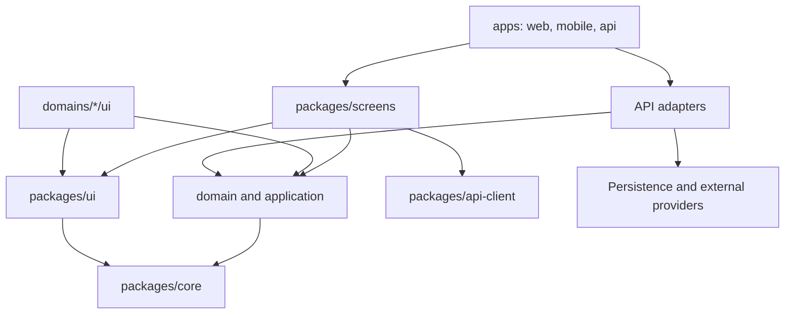

# Architecture Spine - La Cabane du Merle

## Design Paradigm

Modular monolith with hexagonal domain boundaries. `apps` sont les shells de runtime; `packages/domains` portent le metier et ses ports; les adaptateurs techniques vivent a la peripherie de `apps/api`. La V1 deploye le web et l'API; le mobile reste une extension preservee par les memes frontieres.

## Invariants & Rules

### AD-1 - Monorepo organise par runtimes et packages [ADOPTED]

- **Binds:** all
- **Prevents:** logique fonctionnelle dupliquee ou dependance des packages vers une app.
- **Rule:** Les applications deployables sont sous `apps`; le code partage est sous `packages`. `apps/web` et `apps/mobile` peuvent importer `screens`; `apps/api` ne le peut pas. Une app peut importer un package, jamais l'inverse.

### AD-2 - Metier hexagonal par domaine [ADOPTED]

- **Binds:** all domains, API
- **Prevents:** regles metier liees a HTTP, un ORM, une base de donnees ou un fournisseur.
- **Rule:** Chaque domaine separe `domain` et `application`, qui ne dependent que du domaine, de `core` et de leurs ports. Son sous-module `ui` est presentation-only et peut dependre de `@project/ui`; les implementations de ports sont des adaptateurs de `apps/api`.

### AD-3 - Ecrans partages sans routeur [ADOPTED]

- **Binds:** web, mobile, screens
- **Prevents:** ecrans inutilisables hors de Next.js ou Expo Router.
- **Rule:** Les routes Next.js et Expo Router restent minces et transmettent donnees, identifiants et callbacks aux ecrans de `packages/screens`; ces ecrans n'importent aucun routeur.

### AD-4 - Responsive avant variantes de plateforme [ADOPTED]

- **Binds:** screens, domain UI
- **Prevents:** duplication web/native pour une seule difference de mise en page.
- **Rule:** Un ecran est partage par defaut. Une variante `.native`, `.web`, `.ios` ou `.android` n'est creee que si le parcours, la structure ou une interaction change; les adaptations de layout utilisent Tamagui.

### AD-5 - API UI controlee par le projet [ADOPTED]

- **Binds:** UI, screens, domains, web, mobile
- **Prevents:** conventions visuelles et imports Tamagui divergents.
- **Rule:** Seul `packages/ui` importe directement Tamagui et possede sa configuration, ses themes, son provider et son extraction CSS. Tout autre code UI importe les primitives, tokens et composants depuis `@project/ui`; `apps/web` ne porte que l'integration Next.js necessaire a ce package.

### AD-6 - Direction unique des dependances [ADOPTED]

- **Binds:** all
- **Prevents:** cycles entre ecrans, domaines et infrastructure.
- **Rule:** Les dependances suivent `apps -> screens -> domain/application -> core`; `screens` peut aussi utiliser `ui` et `api-client`; `domains/*/ui` peut utiliser le sous-module `domain/application` de son domaine et `ui`. Aucun module `domain` ou `application` n'importe runtime, UI framework, HTTP, ORM ou fournisseur concret.



### AD-7 - Contrats de peripherie et historique immuable [ADOPTED]

- **Binds:** domains, API, persistence, integrations
- **Prevents:** appels directs a des SDK et historique altere par les changements du catalogue.
- **Rule:** Les cas d'usage dependent de contrats de repositories et de services externes definis par leur domaine. Les commandes, publications et compositions historiques stockent les valeurs metier appliquees au moment de l'evenement.

### AD-8 - Versions coherentes et verrouillees [ASSUMPTION]

- **Binds:** web, mobile, UI, workspace manifests
- **Prevents:** incompatibilites entre React, Next.js, Expo et Tamagui.
- **Rule:** Un unique lockfile racine est l'autorite des versions. Les manifests pinnenent les versions seed et toute mise a niveau valide en CI la chaine complete, incluant React, React Native, React Native Web et Node.js; les trois versions seed ne constituent pas a elles seules une garantie de compatibilite.

### AD-9 - Contrat API possede et obligatoire pour les donnees persistantes [ADOPTED]

- **Binds:** API, api-client, screens, domains
- **Prevents:** cas d'usage executes cote client, clients HTTP incompatibles et mutations sans contrat.
- **Rule:** Toute lecture ou mutation depuis un consumer hors de `apps/api` passe par `@project/api-client` et un contrat OpenAPI versionne possede par `apps/api`. Les controllers et jobs backend appellent directement les cas d'usage. Le contrat definit les schemas de requete, reponse, erreur et securite; les clients types ou generes en derivent et chaque version a des tests de conformite API.

### AD-10 - Frontieres verifiees automatiquement [ASSUMPTION]

- **Binds:** all packages and applications
- **Prevents:** violations silencieuses de dependances, imports profonds et cycles.
- **Rule:** Le workspace fournit des verifications locales et CI qui refusent les imports interdits, les imports hors point d'entree public et les cycles entre packages avant integration.

### AD-11 - Responsabilites de livraison explicites [ASSUMPTION]

- **Binds:** apps, API, infra, operations
- **Prevents:** actifs deployes sans proprietaire, migrations non executees ou secrets ranges avec le code partage.
- **Rule:** Chaque app V1 possede son artefact de build et sa configuration runtime; `infra` possede la definition des environnements, le deploiement, les secrets references, la promotion et le retour arriere. `apps/api` possede l'execution des migrations et jobs applicatifs declares par le deploiement.

### AD-12 - Persistence AdonisJS [ADOPTED]

- **Binds:** API, domains, persistence
- **Prevents:** entites metier couplees a Active Record ou persistance hors du backend.
- **Rule:** `apps/api` utilise AdonisJS, PostgreSQL et Lucid. Les modeles Lucid, migrations et transactions restent dans `apps/api`; les repositories adaptateurs traduisent entre ces modeles et les entites metier de `packages/domains`.

### AD-13 - OpenAPI comme contrat HTTP [ADOPTED]

- **Binds:** API, api-client, web, future mobile
- **Prevents:** divergences entre endpoints implementes, clients et documentation.
- **Rule:** Le document OpenAPI 3.1.2 versionne est la source de verite de l'interface HTTP et appartient a `apps/api`. Toute modification incompatible suit une nouvelle version du contrat; `@project/api-client` est valide ou genere depuis celui-ci. Les requetes sont validees a la frontiere HTTP avant l'appel des cas d'usage.

### AD-14 - V1 web, mobile preserve [ADOPTED]

- **Binds:** web, screens, UI, future mobile
- **Prevents:** cout de maintenance d'une app mobile sans besoin V1 ou ecrans web impossibles a reutiliser.
- **Rule:** La V1 ne cree ni ne deploye `apps/mobile`. Les ecrans restent independants du routeur et les composants UI passent par `@project/ui`; une future app Expo utilise les variantes React Native standard uniquement lorsque le parcours ou l'interaction differe.

### AD-15 - Identite et acces API [ADOPTED]

- **Binds:** API, web, customers, AMAP, admin
- **Prevents:** comptes imposes aux clients classiques et liens de suivi donnant un acces plus large que la commande concernee.
- **Rule:** Adonis Auth gere l'authentification et l'autorisation des administrateurs et adherents AMAP cote API. Les sessions web utilisent un cookie opaque `HttpOnly`, `Secure` en production et `SameSite=Lax`; toute mutation authentifiee par cookie applique une protection CSRF. Connexion et recuperation de mot de passe sont limitees par adresse IP et identifiant normalise, avec reponses non enumerables. Les clients classiques n'ont pas de compte: chaque lien de suivi ou modification est un jeton opaque, expire et restreint a la ressource et aux actions autorisees.

### AD-16 - Odoo en peripherie asynchrone [ADOPTED]

- **Binds:** API, integrations, orders, catalog, customers
- **Prevents:** indisponibilite d'Odoo bloquant les operations du maraicher ou workflows metier delegues a Odoo.
- **Rule:** L'application possede les workflows operationnels, AMAP et commandes. Le connecteur Odoo est differe jusqu'a l'audit de son instance; lorsqu'il existe, il est un adaptateur backend asynchrone, relancable et hors du chemin critique. La transaction metier ecrit aussi l'outbox; le worker livre au moins une fois, avec identifiant d'idempotence fournisseur et correspondances explicites entre objets applicatifs et Odoo.

### AD-17 - Execution planifiee fiable [ADOPTED]

- **Binds:** API, AMAP, notifications, integrations
- **Prevents:** generation de commandes ou notifications manquees, doublees ou executees concurremment.
- **Rule:** `apps/api` possede les traitements planifies et asynchrones V1 dans une file PostgreSQL. Un worker unique par environnement interroge la file au plus chaque minute, cree ou reclame atomiquement les travaux avec un verrou a expiration et reprend un travail apres perte du verrou. Les planifications memorisent leur derniere execution attendue et creent au demarrage les occurrences manquees, notamment le traitement AMAP de 06:00 `Europe/Paris`. Chaque tentative est journalisee, idempotente et relancable; un echec temporaire applique un backoff borne et un echec definitif reste visible pour reprise administrative.

### AD-18 - Mutations coherentes par aggregate [ASSUMPTION]

- **Binds:** domains, API, persistence
- **Prevents:** transitions d'etat illegales, ecrasements concurrents et effets externes dupliques.
- **Rule:** Un cas d'usage est l'unique point de mutation d'un aggregate. Il valide la transition sur l'etat courant et persiste toutes les ecritures liees dans une transaction. Pour toute commande HTTP rejouable, `apps/api` possede un enregistrement d'idempotence atomique, scope par operation et principal ou jeton client, qui conserve le resultat initial et le retourne aux repetitions pendant la retention configuree.

### AD-19 - Temps metier unifie [ADOPTED]

- **Binds:** domains, API, AMAP, distribution, scheduling
- **Prevents:** dates limites et occurrences calculees differemment selon le domaine ou le runtime.
- **Rule:** `Europe/Paris` est la timezone metier. Les instants sont stockes et echanges en UTC avec un offset ISO 8601; les recurrents, occurrences et dates limites sont calcules dans la timezone metier avant conversion aux frontieres.

### AD-20 - Recurrences et dates limites explicites [ADOPTED]

- **Binds:** AMAP, distribution, scheduling, API
- **Prevents:** calculs incompatibles de jours recurrents, changement d'heure et droits de modification a la limite.
- **Rule:** Les recurrents de marche, tournee et AMAP sont des dates locales `Europe/Paris`. La recurrence AMAP V1 est hebdomadaire et avance de sept jours calendaires apres livraison ou suspension; un solde nul ou un abonnement inactif n'engendre aucune nouvelle echeance. La compatibilite AMAP est un attribut explicite d'un mode de recuperation actif. Une date limite est un instant `Europe/Paris`; une modification est autorisee strictement avant cet instant et refusee a cet instant ou apres.

## Consistency Conventions

| Concern | Convention |
| --- | --- |
| Naming | Packages et dossiers en kebab-case; types, entites et composants en PascalCase; fonctions en camelCase; evenements au passe (`OrderAccepted`). |
| UI et screens | Chaque composant React ou `styled` de `packages/ui` et `packages/screens` vit dans un fichier kebab-case dedie; les `index.ts` et `index.tsx` ne sont que des barrels de reexports publics et ne definissent aucun composant. |
| Imports | Les consumers utilisent uniquement les points d'entree publics des packages (`@project/domains/orders`, `@project/ui`); pas d'import interne entre packages. |
| State and mutations | Les mutations passent par un cas d'usage de domaine et le contrat OpenAPI; les composants et ecrans ne contiennent pas de regle metier fondamentale. |
| Data history | Les identifiants et jetons de liens clients sont opaques; les dates sont serialisees en ISO 8601 aux frontieres; les valeurs historiques sont des snapshots metier. |
| Time | `Europe/Paris` est la timezone de calcul metier; les instants stockes et transmis sont en UTC avec offset ISO 8601. |
| Configuration | La configuration partagee non-sensitive est dans `packages/config`; les secrets et la configuration runtime restent dans l'environnement du runtime concerne. |
| API | `apps/api` possede le document OpenAPI et la securite declaree; `@project/api-client` ne porte ni endpoints ni schemas ecrits a la main en dehors de ce contrat. |
| Jobs | Les jobs sont reclames atomiquement avec un verrou temporaire, idempotents, journalises et executes par un unique worker par environnement. |

## Stack

| Name | Version |
| --- | --- |
| Next.js | 16.3.2 |
| Node.js | 24.0.0 |
| AdonisJS (`@adonisjs/core`) | 7.5.0 |
| Lucid (`@adonisjs/lucid`) | 22.4.2 |
| PostgreSQL | 18.6 |
| OpenAPI | 3.1.2 |
| Tamagui | 2.7.7 |

## Structural Seed

```text
apps/
  web/                 # Next.js runtime and routes
  api/                 # HTTP boundary, adapters, jobs and bootstrap
    openapi/           # Versioned HTTP contract
    app/adapters/      # Lucid and external-provider implementations
packages/
  screens/             # Cross-platform application composition
  domains/             # Pure domain, use cases, ports and domain UI
  ui/                  # Tamagui configuration and project UI API
  api-client/          # Shared API transport client
  core/                # Technical utilities independent of business domains
  config/              # Shared tooling configuration
  testing/             # Reusable test fixtures and helpers
infra/                 # Provider-specific deployment and operations assets
```

```mermaid
flowchart LR
  web[apps/web] --> screens[packages/screens]
  web --> client[@project/api-client]
  client --> api[apps/api]
  api --> usecases[domains/application]
  usecases --> ports[domain ports]
  api --> adapters[adapters]
  adapters --> db[(PostgreSQL via Lucid)]
  adapters -. future, async .-> odoo[Odoo]
  mobile[Future Expo app] -.-> screens
  mobile -.-> client
```

## Capability -> Architecture Map

| Capability / Area | Lives in | Governed by |
| --- | --- | --- |
| CAP-1 runtime and shared code | `apps`, `packages` | AD-1, AD-3, AD-14 |
| CAP-2 domain rules and use cases | `packages/domains`, `apps/api/app/adapters` | AD-2, AD-6, AD-12 |
| CAP-3 reusable cross-platform UI | `packages/screens`, `packages/ui` | AD-3, AD-4, AD-5, AD-14 |
| CAP-4 persistent data contract and history | `apps/api/openapi`, `@project/api-client`, domains | AD-7, AD-9, AD-12, AD-13 |
| CAP-5 delivery and boundary enforcement | workspace tooling, `infra`, API jobs | AD-10, AD-11, AD-17 |

## Deferred

| Decision | Revisit when |
| --- | --- |
| OpenAPI generation/validation toolchain and API error/pagination conventions | Before the first API endpoint is implemented. |
| Cloud provider, deployment topology and environments | A production availability, data residency or operating-cost requirement exists. |
| Observability, backups, alerting and incident operations | The deployment topology is selected. |
| Odoo connector scope and implementation | The Odoo version, hosting, external API access, licence and existing product/customer data are audited. |
| Data classification, retention and deletion policy | Personal-data and regulatory obligations are specified. |
| Package manager, CI provider, test matrix and release versioning | The workspace is initialized and its delivery targets are selected. |
