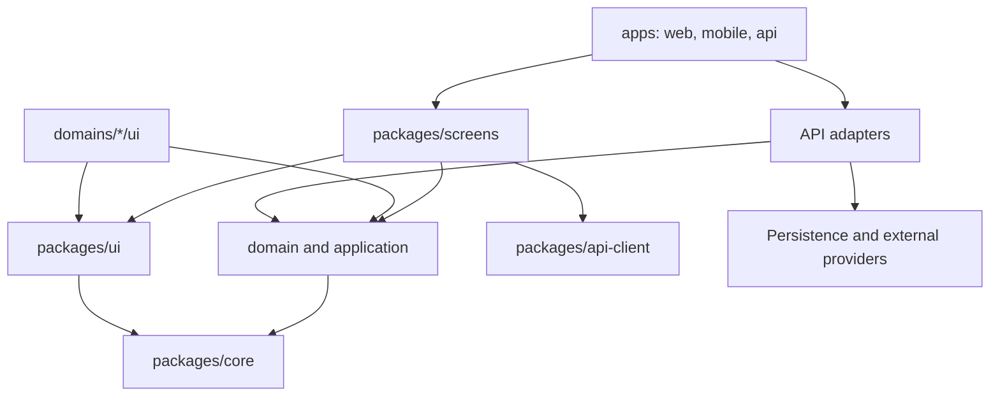

# Architecture Spine - La Cabane du Merle

## Design Paradigm

Modular monolith with hexagonal domain boundaries. `apps` sont les shells de runtime; `packages/domains` portent le metier et ses ports; les adaptateurs techniques vivent a la peripherie de `apps/api`.

## Invariants & Rules

### AD-1 - Monorepo organise par runtimes et packages [ADOPTED]

- **Binds:** all
- **Prevents:** logique fonctionnelle dupliquee ou dependance des packages vers une app.
- **Rule:** Les applications deployables sont sous `apps`; le code partage est sous `packages`. `apps/web` et `apps/mobile` peuvent importer `screens`; `apps/api` ne le peut pas. Une app peut importer un package, jamais l'inverse.

### AD-2 - Metier hexagonal par domaine [ADOPTED]

- **Binds:** all domains, API
- **Prevents:** regles metier liees a HTTP, un ORM, une base de donnees ou un fournisseur.
- **Rule:** Chaque domaine separe `domain` et `application`, qui ne dependent que du domaine, de `core` et de leurs ports. Son sous-module `ui` est presentation-only et peut dependre de `@project/ui`; les implementations de ports sont des adaptateurs de `apps/api`.

### AD-3 - Ecrans partages sans routeur [ADOPTED]

- **Binds:** web, mobile, screens
- **Prevents:** ecrans inutilisables hors de Next.js ou Expo Router.
- **Rule:** Les routes Next.js et Expo Router restent minces et transmettent donnees, identifiants et callbacks aux ecrans de `packages/screens`; ces ecrans n'importent aucun routeur.

### AD-4 - Responsive avant variantes de plateforme [ADOPTED]

- **Binds:** screens, domain UI
- **Prevents:** duplication web/native pour une seule difference de mise en page.
- **Rule:** Un ecran est partage par defaut. Une variante `.native`, `.web`, `.ios` ou `.android` n'est creee que si le parcours, la structure ou une interaction change; les adaptations de layout utilisent Tamagui.

### AD-5 - API UI controlee par le projet [ADOPTED]

- **Binds:** UI, screens, domains, web, mobile
- **Prevents:** conventions visuelles et imports Tamagui divergents.
- **Rule:** Seul `packages/ui` importe directement Tamagui. Tout autre code UI importe les primitives, tokens et composants depuis `@project/ui`.

### AD-6 - Direction unique des dependances [ADOPTED]

- **Binds:** all
- **Prevents:** cycles entre ecrans, domaines et infrastructure.
- **Rule:** Les dependances suivent `apps -> screens -> domain/application -> core`; `screens` peut aussi utiliser `ui` et `api-client`; `domains/*/ui` peut utiliser le sous-module `domain/application` de son domaine et `ui`. Aucun module `domain` ou `application` n'importe runtime, UI framework, HTTP, ORM ou fournisseur concret.



### AD-7 - Contrats de peripherie et historique immuable [ADOPTED]

- **Binds:** domains, API, persistence, integrations
- **Prevents:** appels directs a des SDK et historique altere par les changements du catalogue.
- **Rule:** Les cas d'usage dependent de contrats de repositories et de services externes definis par leur domaine. Les commandes, publications et compositions historiques stockent les valeurs metier appliquees au moment de l'evenement.

### AD-8 - Versions coherentes et verrouillees [ASSUMPTION]

- **Binds:** web, mobile, UI, workspace manifests
- **Prevents:** incompatibilites entre React, Next.js, Expo et Tamagui.
- **Rule:** Un unique lockfile racine est l'autorite des versions. Les manifests pinnenent les versions seed et toute mise a niveau valide en CI la chaine complete, incluant React, React Native, React Native Web et Node.js; les trois versions seed ne constituent pas a elles seules une garantie de compatibilite.

### AD-9 - Contrat API possede et obligatoire pour les donnees persistantes [ASSUMPTION]

- **Binds:** API, api-client, screens, domains
- **Prevents:** cas d'usage executes cote client, clients HTTP incompatibles et mutations sans contrat.
- **Rule:** Toute lecture ou mutation de donnees persistantes depuis web ou mobile passe par `@project/api-client` et un contrat versionne possede par `apps/api`. Les schemas de requete, reponse et erreur sont la source de verite du client; chaque version du contrat a des tests de conformite API.

### AD-10 - Frontieres verifiees automatiquement [ASSUMPTION]

- **Binds:** all packages and applications
- **Prevents:** violations silencieuses de dependances, imports profonds et cycles.
- **Rule:** Le workspace fournit des verifications locales et CI qui refusent les imports interdits, les imports hors point d'entree public et les cycles entre packages avant integration.

### AD-11 - Responsabilites de livraison explicites [ASSUMPTION]

- **Binds:** apps, API, infra, operations
- **Prevents:** actifs deployes sans proprietaire, migrations non executees ou secrets ranges avec le code partage.
- **Rule:** Chaque app possede son artefact de build et sa configuration runtime; `infra` possede la definition des environnements, le deploiement, les secrets references, la promotion et le retour arriere. `apps/api` possede l'execution des migrations et jobs applicatifs declares par le deploiement.

## Consistency Conventions

| Concern | Convention |
| --- | --- |
| Naming | Packages et dossiers en kebab-case; types, entites et composants en PascalCase; fonctions en camelCase; evenements au passe (`OrderAccepted`). |
| Imports | Les consumers utilisent uniquement les points d'entree publics des packages (`@project/domains/orders`, `@project/ui`); pas d'import interne entre packages. |
| State and mutations | Les mutations passent par un cas d'usage de domaine ou un contrat API; les composants et ecrans ne contiennent pas de regle metier fondamentale. |
| Data history | Les identifiants sont opaques; les dates sont serialisees en ISO 8601 aux frontieres; les valeurs historiques sont des snapshots metier. |
| Configuration | La configuration partagee non-sensitive est dans `packages/config`; les secrets et la configuration runtime restent dans l'environnement du runtime concerne. |

## Stack

| Name | Version |
| --- | --- |
| Next.js | 16.3.2 |
| Expo SDK | 57.0.0 |
| Tamagui | 2.7.7 |

## Structural Seed

```text
apps/
  web/                 # Next.js runtime and routes
  mobile/              # Expo runtime and routes
  api/                 # HTTP boundary, adapters, jobs and bootstrap
packages/
  screens/             # Cross-platform application composition
  domains/             # Pure domain, use cases, ports and domain UI
  ui/                  # Tamagui configuration and project UI API
  api-client/          # Shared API transport client
  core/                # Technical utilities independent of business domains
  config/              # Shared tooling configuration
  testing/             # Reusable test fixtures and helpers
infra/                 # Provider-specific deployment and operations assets
```

## Deferred

| Decision | Revisit when |
| --- | --- |
| API framework, HTTP contract and authentication protocol | The first API capability and its client contract are specified. |
| Database, ORM and migration strategy | The first persistent aggregate and its consistency requirements are specified. |
| Cloud provider, deployment topology and environments | A production availability, data residency or operating-cost requirement exists. |
| Observability, backups, alerting and incident operations | The deployment topology is selected. |
| Background job runner and event delivery mechanism | A use case needs asynchronous, scheduled or retryable execution. |
| Authorization, data classification, retention and deletion policy | User roles, personal data and regulatory obligations are specified. |
| Package manager, CI provider, test matrix and release versioning | The workspace is initialized and its delivery targets are selected. |
