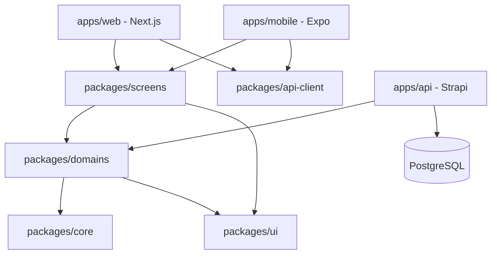
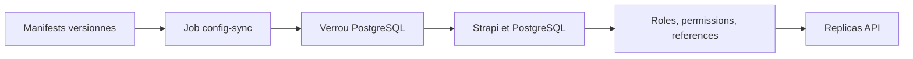
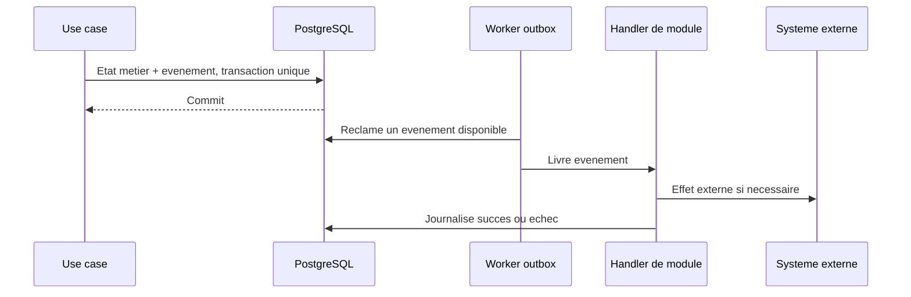
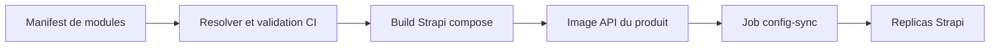
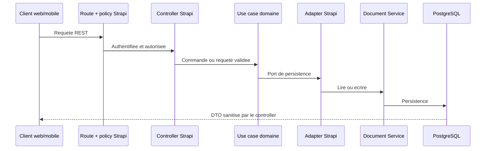

# Architecture technique V1

## Objet

Ce document formalise l'architecture du monorepo Agora. Il fait reference pour les developpeurs; le contrat concis destine aux agents BMad est dans `_bmad-output/planning-artifacts/architecture/architecture-agora-starter-pack-2026-09-09/ARCHITECTURE-SPINE.md`.

Il decrit une architecture cible. Le depot ne fournit actuellement que les shells web, mobile et Strapi, les controles de frontiere existants et la sonde de sante. Resolver de modules, `config-sync`, runner de migration, outbox, worker, scheduler, client OpenAPI genere et controles de securite associes sont des fondations a implementer avant les capacites qui les exigent.

Le starter pack est generique. Les noms comme `orders`, `products`, `customers` ou `AMAP`, employes ci-dessous, ne sont que des exemples pour rendre les regles concretes; ils ne definissent pas le modele metier d'un systeme qui adopte ce starter.

Le principe directeur est le suivant :

> Les apps fournissent le runtime et le routing; les packages fournissent l'application.

La solution est un monolithe modulaire hexagonal, organise en monorepo pnpm. Elle comprend une application web Next.js, une application mobile Expo et une API Strapi 5 reliee a PostgreSQL.

## Responsabilites et dependances



Les applications sont deployables et responsables de leur bootstrap, de leurs providers, de leur routing et de leurs integrations de plateforme. Elles ne portent pas les regles fonctionnelles reutilisables.

Les imports entre packages passent par leurs points d'entree publics `@project/*`. La direction imposee est `apps -> screens -> domains -> core`, avec `screens -> ui|api-client` et `domains -> ui|core` lorsque cela est justifie. Les packages ne dependent jamais d'une application ou de Strapi. Les controles de frontiere du depot rejettent toute dependance d'un package vers une app et toute dependance hors de cette direction.

## Arborescence cible

```text
apps/
  web/
    src/app/                    # routes et layouts Next.js fins
    src/providers/
    src/platform/               # integrations web uniquement
  mobile/
    app/                        # routes Expo fines
    src/providers/
    src/platform/               # permissions et integrations natives
  api/
    src/                        # runtime Strapi et adaptations de base
    src/policies/
    src/middlewares/
    config/
    .generated/strapi/src/api/  # sortie non versionnee de la composition
packages/
  screens/                      # ecrans partages
  domains/                      # domaines, application, API client et UI metier
  ui/                           # API UI fondee sur Tamagui
  api-client/                   # acces REST partage
  core/                         # date, money, errors, result, etc.
  config/                       # configurations partagees sans secrets
docs/
  architecture/
  decisions/
  api/
infra/                          # deploiement, exploitation et scripts
```

L'arborescence est une direction. Un repertoire ou une abstraction n'est cree que lorsqu'un besoin le justifie.

## Web et mobile

`apps/web` utilise Next.js et `apps/mobile` utilise Expo. Une route reste mince et monte un ecran provenant de `@project/screens`.

```tsx
import { OrderDetailsScreen } from '@project/screens/admin/orders';

export default function Page({ params }: { params: { id: string } }) {
  return <OrderDetailsScreen orderId={params.id} />;
}
```

Un ecran ne doit pas importer `next/navigation` ni `expo-router`. Les parametres et actions de navigation lui sont transmis par props, par exemple `onOpenOrder(orderId)`.

Les ecrans sont partages par defaut. `screen.tsx` est l'implementation commune; une variante `screen.native.tsx`, `screen.web.tsx`, `screen.ios.tsx` ou `screen.android.tsx` n'est ajoutee que si le parcours, la structure ou l'interaction differe reellement. Une difference de grille ou d'empilement responsive est geree par Tamagui et ne justifie pas une duplication.

## UI cross-platform

Tamagui est la fondation UI assumee du projet. `@project/ui` en definit l'API, les tokens, themes, variants, tailles, espacements et conventions responsive. Les domaines et les ecrans importent donc les primitives depuis `@project/ui`, pas depuis `tamagui`.

```tsx
import { Button, YStack } from '@project/ui';

<YStack gap="$4" padding="$5">
  <Button variant="primary" size="md">Accepter</Button>
</YStack>;
```

Seul `packages/ui` peut importer Tamagui. `packages/ui` et `packages/screens` ne contiennent jamais de JSX HTML natif, y compris `div`, `main`, `form`, `input`, `label` ou `a`. `packages/ui` construit ses composants avec Tamagui; les ecrans consomment exclusivement les primitives portables exposees par `@project/ui`. Les particularites HTML propres a Next.js restent dans `apps/web`. Le lint du depot rejette les elements JSX HTML intrinseques dans ces deux packages.

Chaque composant est dans un fichier kebab-case. Les barrels `index.ts` ou `index.tsx` n'exposent que l'API publique par reexports.

## Domaines et ecrans

Les domaines sont independants du runtime. Lorsqu'un domaine devient significatif, sa structure cible est :

```text
packages/domains/<domain>/
  domain/                        # entites, value objects, invariants, evenements
  application/                   # cas d'usage et ports
  api/                           # DTO, queries, mutations, hooks client
  ui/                            # composants fonctionnels reutilisables
  index.ts                       # API publique
```

Le domaine ne depend ni de Strapi, HTTP, PostgreSQL, Next.js, Expo, React Native ni Tamagui. Il definit les ports dont ses cas d'usage ont besoin, par exemple un `OrderRepository` ou un `NotificationSender`.

`packages/domains/<domain>/ui` contient un composant lie a un concept metier reutilisable, tel que `OrderSummary`. `packages/screens` contient la composition d'un parcours ou d'un ecran, tel que `OrderDetailsScreen`, qui peut assembler plusieurs domaines. La relation est toujours `screens -> domains`, jamais l'inverse.

`packages/core` contient seulement des briques techniques sans metier: resultat, erreurs, date, monnaie, stockage ou journalisation. Les dossiers fourre-tout tels que `utils`, `helpers`, `common` et `shared` sont evites.

## API Strapi et PostgreSQL

### Role de Strapi

`apps/api` utilise Strapi `5.33.0` avec PostgreSQL. Strapi est le runtime backend, le proprietaire des content-types, du back office, des plugins, des routes HTTP et de l'acces a PostgreSQL. Dans une image composee, les schemas actifs sont materialises dans le `src/api` de l'application Strapi de build; les sources restent exclusivement dans `modules/<module>/src/api`.

Strapi n'est pas seulement un CMS expose par defaut. Il est adapte comme monolithe modulaire : ses routes, controllers, services et policies servent de peripherie technique a un coeur metier situe dans `packages/domains`.

### Configuration par le code

La configuration Strapi est geree par le code et versionnee dans Git. L'interface d'administration ne constitue jamais une source de verite de configuration. Elle est uniquement utilisee pour consulter ou, lorsque le registre l'autorise explicitement, administrer du contenu editorial.

Cette regle separe volontairement configuration et contenu : les roles, permissions, schemas, routes et donnees de reference convergent depuis le code; le contenu des content-types classes `editorial` est modifiable dans Strapi lorsque leur registre l'autorise. `config-sync` ne cree, ne met a jour et ne supprime jamais ce contenu editorial mutable.

| Element | Source de verite | Mode d'application |
| --- | --- | --- |
| Content-types et composants | `src/api/**/content-types`, `src/components` | Chargement et synchronisation Strapi au demarrage |
| Routes, controllers, services, policies et middlewares | `src/**`, `config/**` | Chargement depuis le depot |
| Roles et permissions | Manifeste declaratif versionne dans `apps/api` | Synchronisation idempotente au deploiement |
| Donnees de reference | Manifeste TypeScript du module proprietaire, compose au build | Synchronisation ou migration idempotente au deploiement |
| Contenu editorial | Base de donnees Strapi | Administration dans Strapi si le registre du type le permet; exclu de `config-sync` |
| Secrets, tokens et URLs propres a l'environnement | Gestionnaire de secrets et variables d'environnement | Injection au deploiement, jamais dans Git |

Le Content-Type Builder ne doit pas etre utilise pour concevoir un schema qui ne serait pas ensuite versionne. Une modification de schema commence par un changement de fichier dans le depot, est revue, testee et deployee comme le reste du code.

Les roles et permissions constituent une configuration fonctionnelle, pas une operation manuelle de back office. Ils seront decrits dans un manifeste stable, avec des cles fonctionnelles plutot que des identifiants de base de donnees, puis appliques par une synchronisation idempotente.

### Job `config-sync`

Un job `config-sync` est lance une fois, depuis la meme image que l'API, avant le demarrage ou le renouvellement des replicas Strapi. Il est bloquant : un echec empeche le deploiement de l'API.



Le job suit ces regles :

1. Il acquiert un verrou PostgreSQL exclusif. Si un autre job est en cours, il attend selon le timeout de deploiement puis echoue sans appliquer de changement.
2. Il charge les manifests de roles depuis `apps/api` et les manifests de donnees de reference composes par le resolver.
3. Il identifie chaque ressource geree par une cle fonctionnelle stable, jamais par un identifiant de base de donnees propre a un environnement.
4. Il cree ou met a jour les ressources gerees afin de converger vers le manifeste. Le code est donc l'autorite pour ces ressources.
5. Il n'efface aucune ressource implicitement. Une suppression ou une migration destructive exige une migration versionnee et une decision explicite.
6. Il echoue sur une derive non gerable plutot que de conserver une configuration ambigue.
7. Il ne lit ni n'ecrit de secret dans les manifests. Les secrets, tokens, URLs et activations propres a un environnement proviennent du deploiement.

Les replicas API n'executent pas la synchronisation. `bootstrap()` Strapi peut servir a une initialisation locale explicitement demandee, mais n'est pas le mecanisme de convergence en environnement partage ou de production.

Le job sera controle en CI sur une base vierge, puis rejoue sur cette meme base. Le second passage doit terminer sans modification fonctionnelle. Les migrations Strapi de `database/migrations` restent reservees aux transformations ponctuelles de schema ou de donnees et ne remplacent pas ce mecanisme de convergence.

### Donnees de reference

Les donnees de reference sont des valeurs fonctionnelles pilotees par le code et necessaires au fonctionnement d'un systeme. Elles se distinguent du contenu editorial modifiable dans Strapi, des enums internes au domaine et des fixtures de test. Elles sont definies dans des manifests TypeScript, avec une cle fonctionnelle stable et des relations exprimees par ces cles.

Un module proprietaire exporte un ou plusieurs manifests depuis `src/configuration/reference-data.ts`; le resolver les agrege dans la composition active. La forme est volontairement petite et typee :

```ts
export default defineReferenceManifest({
  uid: 'api::unit.unit',
  keyField: 'key',
  managedFields: ['label', 'sortOrder', 'active'],
  operatorFields: [],
  records: [
    {
      key: 'each',
      data: { label: 'Each', sortOrder: 10, active: true },
      relations: {},
    },
  ],
});
```

La cle d'un record est unique pour son `uid`. `data` ne contient que des champs declares dans `managedFields`; `relations` contient des references `{ uid, key }`, jamais un identifiant Strapi. `operatorFields` declare les champs que `config-sync` doit conserver, par exemple une note locale explicitement autorisee. Le resolver rejette un doublon `(uid, key)`, un champ non possede ou une relation vers une cle absente avant que `config-sync` ecrive en base. IDs Strapi, secrets et contenu editorial sont interdits dans ces manifests.

`config-sync` cree les valeurs absentes et met a jour les champs dont il est proprietaire. Il ne supprime ni n'archive jamais implicitement une valeur qui disparait du manifeste. Un retrait, un remplacement ou un archivage requiert une migration versionnee, afin de proteger les donnees historiques et les relations existantes.

### Schemas et migrations Strapi

Les schemas de content-types et composants sont definis uniquement dans Git. Aucune modification manuelle de structure dans l'interface ou directement dans PostgreSQL n'est autorisee.

Les migrations Strapi versionnees dans `apps/api/database/migrations` sont utilisees pour toute transformation de donnees ou modification destructive. Elles sont executees avant la synchronisation automatique du schema Strapi et travaillent donc prioritairement avec Knex sur l'ancien schema. Chaque migration est testee sur une base representant la version precedente, puis rejouee pour verifier qu'elle ne s'execute qu'une fois.

Le deploiement execute les migrations dans un contexte unique avant les replicas API. Une sauvegarde PostgreSQL est obligatoire avant toute migration destructive. Strapi ne fournissant pas de migration descendante, un rollback consiste en un correctif vers l'avant ou une restauration de sauvegarde.

`forceMigration: false` ne doit pas etre utilise comme une securite de production : il peut laisser des structures non gerees et masquer une derive de schema.

Toute evolution de schema a risque suit la sequence `expand -> migrate -> contract` :

1. Ajouter la nouvelle structure en conservant la precedente compatible.
2. Migrer ou backfiller les donnees et adapter les lectures/ecritures.
3. Retirer l'ancienne structure dans un deploiement ulterieur, avec une migration explicite.

## Modules et plugins Strapi

Le starter adopte une modularite hybride. Un domaine metier reste dans `packages/domains` et ne depend jamais de Strapi. Lorsqu'une capacite est activee dans une application Strapi, son adaptation vit dans un module workspace `modules/<module>`. Un plugin Strapi n'est cree que pour une capacite transversale qui doit etre distribuee ou reutilisee entre applications Strapi.

```text
packages/
  domains/<domain>/              # metier pur et ports
  <cross-cutting>-core/          # coeur reutilisable si justifie
modules/
  <module>/                      # adaptation Strapi activable
apps/api/
  src/modules/manifest.ts        # composition versionnee du produit
  src/extensions/                # adapters de plugins Strapi existants
  plugins/<plugin>/              # seulement apres extraction justifiee
```

Les adaptations Strapi activables sont finalement sourcees dans des packages workspace `modules/<module>`, plutot que dans `apps/api`. Chaque package declare sa cle, ses dependances et les ressources dont il est proprietaire. Le resolver selectionne les modules actifs et les materialise dans un repertoire Strapi genere avant le build; ce repertoire ne doit pas etre edite manuellement ni versionne.

```text
modules/
  <module>/
    package.json
    module.ts                     # cle, dependances, ressources possedees
    src/
      api/                        # content-types, routes, controllers, services
      configuration/              # capacites et donnees de reference
apps/api/
  src/modules/manifest.ts         # composition du produit
  .generated/strapi/              # sortie temporaire du resolver
```

Le workspace pnpm inclura `modules/*` lorsque le premier module sera cree. Un module workspace est une unite interne de composition et de reutilisation; il ne devient pas automatiquement un plugin Strapi public.

Le manifeste de modules declare les capacites actives et leurs dependances. Il est valide en CI avant le deploiement : dependances resolues, absence de cycle, proprietaire unique des routes, content-types, migrations, jobs, donnees de reference et permissions, et absence de capacite accordee pour un module inactif.

Un module declare les capacites qu'il fournit, jamais les roles Strapi du produit. Le manifeste d'autorisation situe dans `apps/api` compose les roles a partir des capacites des seuls modules actifs. Ainsi, une meme capacite peut etre attribuee a des roles differents selon le systeme qui adopte le starter, sans modifier le module qui la fournit.

Les dependances de modules forment un graphe strict : `dependsOn` ne contient que des dependances obligatoires, resolues transitivement et sans cycle. Une integration facultative n'est pas exprimee par une dependance optionnelle dans un module. Elle devient un module-pont, actif seulement lorsque ses deux modules de reference sont presents. Par exemple, une integration entre une capacite RGPD et un fournisseur d'identite est un module distinct qui depend explicitement de `rgpd` et de `identity`.

Les implementations alternatives d'une meme responsabilite utilisent des slots d'exclusivite nommes. Un module peut fournir un slot tel que `identity-provider`, `email-provider` ou `object-storage`; le resolver refuse une composition qui active plus d'un fournisseur pour le meme slot. Les modules ne declarent pas de liste de conflits directs avec les cles d'autres modules, afin que l'ajout d'un fournisseur n'oblige pas a modifier tous les fournisseurs existants.

### Contrats entre modules

Les modules actifs s'executent dans le meme processus Strapi, mais ne s'appellent pas via `strapi.service()` et ne s'importent jamais par des chemins internes. Une dependance synchrone passe par un contrat TypeScript public ou un port explicite fourni par le module proprietaire. Cette regle preserve le test unitaire du domaine et empeche les identifiants Strapi de devenir une API interne implicite.

Les reactions asynchrones utilisent les evenements metier persistants emis apres commit. Un module consommateur declare son abonnement dans sa composition et traite l'evenement de facon idempotente. HTTP est reserve aux systemes qui sont reellement hors du deploiement courant, tels qu'un fournisseur tiers ou une autre application independamment deployee.

### Outbox transactionnel

Les evenements internes utilisent un outbox PostgreSQL unique, technique et non expose dans le Content Manager Strapi. Une commande persistante ecrit son etat metier et l'evenement dans la meme transaction. Elle ne contacte aucun fournisseur externe dans cette transaction.



L'enveloppe minimale contient un identifiant immuable, un type d'evenement, sa version de schema, sa date, l'identifiant de l'aggregate, le payload snapshot necessaire, ainsi que les identifiants de correlation et causalite lorsque disponibles. Elle ne contient pas de donnees personnelles inutiles.

Le worker livre les evenements au moins une fois. Chaque handler doit donc etre idempotent et journaliser son traitement par couple evenement-handler. Les echecs sont reessayes selon une politique bornee; un echec final reste visible dans l'outbox pour une reprise operationnelle. Aucun broker distribue n'est introduit en V1.

Le worker est deploye comme un service distinct de l'API HTTP, avec une commande dediee, mais depuis la meme image Strapi composee. Il charge ainsi exactement les memes modules, handlers et contrats que les producteurs d'evenements. Son nombre de replicas et ses ressources peuvent evoluer independamment sans concurrencer les requetes HTTP.

Plusieurs replicas worker peuvent traiter l'outbox. Chaque replica reclame un petit lot dans une transaction courte avec verrou de lignes PostgreSQL et `FOR UPDATE SKIP LOCKED`, puis marque les evenements avec son identifiant et un bail expirant. Il traite ce lot apres liberation du verrou, y compris lorsqu'un handler appelle un systeme externe. Un evenement dont le bail expire sans succes redevient disponible et peut etre repris par un autre worker apres un crash.

Les erreurs permanentes, par exemple une charge invalide ou une capacite desactivee, font echouer l'evenement immediatement. Les erreurs transitoires ont huit tentatives maximum, avec backoff exponentiel, jitter et attente plafonnee a une heure. Apres l'echec final, l'evenement est marque `failed`, une alerte est emise et sa reprise requiert une action operationnelle explicite. Le worker ne rejoue jamais indefiniment un evenement en echec.

L'exploitation de l'outbox est independante du fournisseur de monitoring. Le worker produit des logs JSON structures et des metriques OpenTelemetry portant au minimum l'identifiant et le type de l'evenement, le handler, le numero de tentative, la duree et le resultat. `infra` choisit l'exporteur, les tableaux de bord et les seuils d'alerte par environnement.

Une commande operateur versionnee permet d'inspecter un evenement `failed` et de le replanifier explicitement. Elle ne rejoue pas d'effet externe elle-meme : elle remet l'evenement dans le flux normal afin que le meme handler idempotent, les memes logs et les memes garanties de retry s'appliquent.

### Image composee par produit

Chaque produit deploie une image Strapi composee au build depuis son manifeste de modules. Le resolver calcule la fermeture des dependances, valide la composition, puis materialise uniquement les adaptations Strapi des modules actifs dans le repertoire de build. Strapi ne charge donc ni content-type, ni route, ni job d'un module inactif.



L'activation ou la desactivation d'une capacite est un changement de composition versionne, suivi d'un nouveau build et d'un deploiement. Ce n'est pas un toggle runtime. Une desactivation retire le module de l'image seulement apres application de la politique non destructive et verification de ses dependances; la desinstallation definitive reste une migration explicite. Le protocole de materialisation doit nettoyer son application Strapi de build avant chaque composition et prouver qu'un module inactif n'est pas enregistre par Strapi.

Un module a toujours un proprietaire unique pour chacune de ses ressources. Les autres modules utilisent son API ou ses ports; ils ne modifient jamais directement ses content-types, donnees de reference, migrations, routes, jobs ou permissions.

La desactivation normale est non destructive : routes, permissions, jobs et surfaces d'administration sont retires, mais les donnees restent conservees. Une desinstallation definitive impose un projet de migration qui traite export, anonymisation, archivage, relations et retrait de schema.

### RGPD

Une capacite RGPD potentiellement reusable est construite autour d'un coeur TypeScript a ports. Il porte les demandes de personnes concernees, l'export, l'anonymisation, la retention et l'audit. Les modules produits implementent les ports pour localiser et traiter leurs propres donnees personnelles.

Une extension de Users & Permissions traduit seulement un utilisateur Strapi vers la representation de personne concernee et branche les routes ou permissions Strapi. Elle est optionnelle : le coeur RGPD ne depend ni de ce plugin ni d'un schema d'identite particulier.

Un module n'est extrait en plugin Strapi qu'apres preuve de reutilisation entre applications, ou besoin explicite de distribution. Il doit alors fournir une API publique, une configuration documentee, des tests d'upgrade et de desinstallation, et ne pas dependre des content-types propres a son premier produit.

### Manifeste d'autorisation metier

Les roles et permissions sont des manifests TypeScript metier. Ils ne recopient pas le format de persistence interne du plugin Users & Permissions, qui reste une detail d'implementation Strapi.

```text
apps/api/src/configuration/
  authorization/
    capabilities.ts             # capacites semantiques et routes liees
    roles.ts                    # roles et capacites accordees
    types.ts                    # types TypeScript du manifeste
    strapi-adapter.ts           # traduction vers Users & Permissions
  reference-data/
    index.ts                    # donnees de reference declaratives
  config-sync.ts                # orchestration du job
```

Le manifeste distingue trois notions :

| Notion | Responsabilite | Exemple indicatif |
| --- | --- | --- |
| Role | Ensemble de capacites attribuables a un utilisateur | `customer`, `operator`, `administrator` |
| Capacite | Autorisation fonctionnelle stable | `orders.create`, `orders.read-own`, `orders.accept` |
| Binding Strapi | Route, action et policy qui appliquent une capacite | `POST /orders/:documentId/accept` lie a `orders.accept` |

Un role reference uniquement des cles de capacites. Une capacite reference les bindings Strapi qui l'appliquent. Cette separation permet de faire evoluer une route ou le plugin sans renommer les droits fonctionnels du produit.

```ts
const roles = [
  {
    key: 'customer',
    capabilities: ['orders.create', 'orders.read-own'],
  },
] as const;

const capabilities = [
  {
    key: 'orders.accept',
    bindings: [{ route: 'orders.accept', policy: 'global::require-capability' }],
  },
] as const;
```

Cet exemple definit une forme cible et non des roles deja actifs. Aucun content-type ni aucun parcours authentifie n'existe encore dans le depot; les premiers roles et capacites seront ajoutes avec le premier flux produit.

L'adapter Strapi est la seule couche qui connait les identifiants et structures du plugin Users & Permissions. Il valide les cles du manifeste, cree ou met a jour les roles geres, associe les permissions techniques aux actions exposees et produit un rapport de synchronisation. Une route sans capacite declaree, une capacite inconnue ou un role manuel qui entre en conflit avec une ressource geree font echouer `config-sync`.

Une permission de route ne suffit pas aux acces fins. Une capacite comme `orders.read-own` autorise l'entree dans le flux; la policy puis le cas d'usage controlent que l'utilisateur est bien proprietaire de la commande. Les permissions Strapi globales ne sont donc jamais utilisees seules pour proteger une ressource appartenant a un utilisateur.

`src/index.ts` peut contenir la logique Strapi `register` ou `bootstrap` necessaire. Les migrations versionnees de `database/migrations` servent aux transformations de donnees et de schema qui doivent s'executer une fois. Les deux mecanismes sont testes dans un environnement vierge puis sur une base representant la version precedente avant une mise en production.



Les controllers sont fins: lecture et validation des entrees, passage de l'identite utile, invocation du cas d'usage, serialization et sanitization de la sortie. Les services Strapi ne deviennent pas un deuxieme domaine: ils composent les adapters, le Document Service, les fournisseurs et les transactions techniques necessaires.

Les entites de domaine et les content-types Strapi sont des representations distinctes. Un mapper dans `apps/api` traduit entre les deux. Le code partage n'importe ni `@strapi/strapi`, ni un type Strapi, ni un client PostgreSQL.

### CRUD editorial et commandes transactionnelles

Strapi genere naturellement des routes CRUD pour les content-types. Elles conviennent aux ressources editoriales dont les operations et droits sont reellement du CRUD, par exemple un contenu catalogue ou une configuration publiee apres validation explicite.

Elles ne conviennent pas par defaut aux aggregates transactionnels, comme une commande, une livraison ou une consommation de panier AMAP. Ces actions passent par des routes de commande explicites :

```text
POST /api/orders/:documentId/accept
POST /api/orders/:documentId/prepare
POST /api/orders/:documentId/deliver
POST /api/availability-publications/:documentId/publish
```

Ces routes appellent un controller puis un cas d'usage. Les endpoints CRUD generes peuvent etre limites ou desactives pour ces aggregates. Le Content Manager Strapi n'est pas une voie de contournement des invariants transactionnels: les roles d'administration y sont limites aux operations autorisees par le produit.

Avant implementation, chaque content-type est inscrit dans un registre avec sa classification (`editorial`, `transactionnel` ou `historique`), son proprietaire, ses voies d'ecriture et ses permissions Content Manager. Par defaut, un type transactionnel ou historique interdit les ecritures CRUD publiques et les ecritures depuis le Content Manager. Toute exception est documentee dans une ADR.

### Validation, autorisation et erreurs

Les policies et middlewares Strapi assurent l'authentification, l'autorisation de frontiere et les controles transverses. Le rate limiting est configure explicitement par surface exposee: le plugin Users & Permissions protege ses endpoints d'authentification; les routes de commande doivent ajouter une configuration ou un middleware dedie avant leur exposition. Les controllers utilisent les mecanismes Strapi de validation et de sanitization des entrees et sorties. Un controle de droit fonctionnel indispensable a un invariant reste aussi porte par le cas d'usage.

Le contrat REST expose des DTO explicites et des erreurs stables. Il ne retourne pas directement une entite domaine ni une forme de content-type Strapi. `@project/api-client` est la cible unique pour base URL, en-tetes d'authentification, serialisation, erreurs et modules par groupe de routes; l'implementation actuelle ne couvre encore que la sonde de sante et doit evoluer avec le premier endpoint produit. Web et mobile ne font pas d'appels HTTP ad hoc.

L'API utilise REST en V1. Apres composition, une commande explicite `strapi openapi generate` genere la specification OpenAPI 3.1 canonique versionnee dans `docs/api`; `@project/api-client` est derive de cette specification, et non des content-types Strapi. Le fichier actuel `packages/api-client/src/openapi.ts` est un point de depart temporaire, pas encore un contrat produit complet.

La generation OpenAPI Strapi etant experimentale, elle n'est pas l'unique garantie de contrat. Les tests de contrat executent les routes composees, en particulier les routes de commande et leurs DTO, puis detectent tout ecart avec la specification et le client genere. La specification complete n'est pas exposee par HTTP en production par defaut; une exposition est une decision explicite de l'environnement concerne.

Les endpoints produits commencent sous `/api/v1` des le premier contrat. Les changements compatibles, tels que l'ajout d'un endpoint ou d'un champ optionnel, restent dans la meme version. Une rupture cree `/api/v2`; les deux versions coexistent jusqu'a une date de retrait documentee. Les endpoints operationnels, tels que `GET /api/health`, restent hors version produit.

### Identifiants publics et conformite

`documentId` est l'unique identifiant Strapi public. Il est une chaine opaque dans OpenAPI et les DTO, dans les URLs, les relations publiques et les evenements; le `id` primaire Strapi n'est jamais expose. L'adapter Strapi convertit ce `documentId` en `EntityId` opaque pour le domaine, qui ne depend donc ni de la representation ni de la longueur choisie par Strapi.

La CI protege ce contrat de quatre facons : elle regenere OpenAPI et le client puis exige un diff Git vide; elle valide les reponses de routes composees contre leur schema OpenAPI; elle teste sur fixture que la lecture, une commande et une relation renvoient le meme `documentId`; elle echoue si le payload, l'URL ou l'evenement expose un `id` interne. Les format UUID, longueur fixe et identifiant numerique ne font pas partie du contrat public.

Les succes REST utilisent l'enveloppe Strapi stabilisee `{ data, meta? }`. `data` porte le DTO unique ou la collection; `meta` porte seulement les metadonnees contractuelles, telles que pagination ou correlation. Les controllers et routes personnalisees conservent cette forme pour ne pas multiplier les conventions client.

Les erreurs sont normalisees au format RFC 9457 Problem Details. Elles incluent les champs standards `type`, `title`, `status`, `detail` et `instance`, ainsi qu'un `code` applicatif stable et, pour une validation, les erreurs de champs. L'adapter HTTP traduit les erreurs internes Strapi vers ce contrat et ne retourne pas les details techniques ou les formes internes du framework.

Les collections produit utilisent une pagination par curseur opaque. Elles acceptent `limit` et `after`; le curseur encode l'ordre stable declare par l'endpoint et le curseur de la page suivante est retourne dans `meta`. Un compte total est absent par defaut et n'est expose que lorsqu'il est explicitement justifie par le contrat. Les bornes de `limit` et l'erreur de curseur invalide sont documentees dans OpenAPI. Les pages numerotees Strapi ne sont pas une convention de l'API produit.

Chaque commande `POST /api/v1` exige l'en-tete `Idempotency-Key`. La cle est scopee par acteur et endpoint, associee au hash du payload et conserve le resultat initial pendant 24 heures. Un retry avec la meme cle et le meme payload retourne le resultat initial; la meme cle avec un payload different retourne `409 Conflict`. La reservation de la cle, la mutation metier et l'ecriture outbox sont effectuees dans la meme transaction.

### Identite

Users & Permissions est le fournisseur `identity-provider` de V1, derriere un adapter Strapi afin de rester remplacable. Il gere les comptes des utilisateurs finaux, les roles et permissions API, ainsi que les sessions refresh avec tokens d'acces courts. La configuration sera introduite avec le premier parcours authentifie; l'API actuelle conserve donc la configuration Strapi par defaut.

Le web utilise des cookies HttpOnly securises pour la session; le mobile utilise le stockage securise natif. La configuration du premier parcours authentifie inclut obligatoirement CORS, cookies, CSRF et refresh session selon les origines reellement deployees. Les API tokens Strapi sont reserves aux integrations serveur-a-serveur et ne sont jamais embarques dans le web ou le mobile. Les administrateurs du back office Strapi sont distincts des utilisateurs finaux.

Une future identite externe ou SSO peut remplacer cet adapter via le slot `identity-provider`; la taxonomie precise des roles sera decidee avec les premiers parcours reels.

### Autorisation metier

L'autorisation est appliquee en trois couches. Users & Permissions authentifie l'appelant. La policy Strapi liee a la route verifie que son role possede la capacite declaree par le module. Enfin, le cas d'usage recoit un `Actor` independant de Strapi et applique le droit reel sur la ressource : possession, perimetre organisationnel et invariants metier.

Les filtres envoyes par le client ne determinent jamais son perimetre d'acces. Les requetes metier construisent ce perimetre a partir de l'`Actor`; un filtre client ne peut ensuite que le restreindre. Cette regle s'applique aux lectures comme aux mutations.

### Multi-tenancy

Le starter V1 ne fixe aucun modele multi-tenant. Il n'ajoute ni content-type `tenant` ou `organization`, ni relation obligatoire dans les donnees, ni filtre global. `Actor` peut porter un scope futur sans imposer sa semantique. Un produit qui exige l'isolation entre plusieurs organisations doit prendre une decision specifique sur son modele d'isolation et adapter explicitement ses schemas, requetes, contraintes, jobs, outbox et exports de donnees.

## Tests de modules et compositions

Les tests suivent une pyramide de composition. Les domaines purs sont testes unitairement sans Strapi ni PostgreSQL. Chaque module est ensuite teste contre sa fermeture de dependances pour valider ses contrats, ressources declarees et capacites. Les compositions de reference sont testees en integration avec Strapi et PostgreSQL.

La CI verifie le resolver, `config-sync` sur une base vierge puis sur sa propre sortie, les migrations depuis une base representant la version precedente, ainsi que le contrat OpenAPI et le client derive. Elle ne tente pas le produit cartesien de tous les modules : chaque composition de reference est declaree et justifiee par un produit ou une integration-pont.

Les fixtures de composition sont explicites : `base` ne contient aucun module optionnel; chaque module est teste avec sa fermeture de dependances; chaque module-pont et fournisseur de slot a sa fixture; chaque produit reel declare sa propre composition. Il n'existe pas de composition `full` generique, car les fournisseurs exclusifs et integrations facultatives ne representent pas un produit coherent lorsqu'ils sont tous actives ensemble.

## Livraison et promotion

Un produit est livre sous forme d'une image Strapi composee et immuable. Le meme digest est promu entre environnements; seuls les secrets et valeurs propres a l'environnement sont injectes au deploiement. Une image ne doit jamais etre reconstruite pour un environnement de promotion.

L'ordre de deploiement est obligatoire : resolver et validation de composition, build de l'image, migration et synchronisation unique du schema, `config-sync`, puis replicas API HTTP, worker et scheduler. Le mecanisme concret du job de migration Strapi reste a implementer, mais aucun replica ne peut demarrer avant son succes et celui de `config-sync`.

Un rollback de code n'est autorise que si le schema reste compatible. Sinon, la reponse est un correctif vers l'avant ou une restauration de sauvegarde suivant la politique de migration.

### Profils de deploiement

Le starter supporte les profils suivants sans changer le contrat applicatif. Chaque profil execute la meme image composee et les commandes distinctes `migrate`, `config-sync`, `api`, `worker` et `scheduler`.

| Profil | Composition | Usage et limites |
| --- | --- | --- |
| `local` | Docker Compose: PostgreSQL, image API et services auxiliaires locaux | Simulation de reference. MinIO, Mailpit et OTel peuvent completer Compose. LocalStack est optionnel pour tester des integrations AWS, mais ne reproduit pas les garanties ECS ou RDS. |
| `mvp-single-vps` | Un VPS: reverse proxy, application et PostgreSQL | MVP uniquement. Point de panne unique; sauvegardes hors hote obligatoires. |
| `split-vps` | Un VPS applicatif et un VPS PostgreSQL distinct | Baseline economique recommandee. PostgreSQL n'accepte que le reseau prive ou WireGuard; `pgBackRest` archive les WAL et sauvegardes chiffrees vers un stockage objet EEE. |
| `split-managed-postgres` | VPS applicatif et PostgreSQL manage distinct | Variante recommandee lorsque l'equipe ne veut plus operer PostgreSQL. Base, sauvegardes et stockage objet restent dans la meme region EEE. |
| `eu-managed-containers` | Conteneurs, jobs et PostgreSQL manages UE | Equivalent europeen portable a ECS/RDS. Scaleway Serverless Containers ou Kapsule, et OVHcloud Managed Kubernetes sont des implementations possibles; les services de registre, stockage objet, secrets et observabilite restent en EEE. |
| `aws-ecs-rds` | ECS Fargate, RDS PostgreSQL, ECR et services AWS associes | Profil scalable, mais AWS reste soumis au droit americain. Il exige une analyse de transfert, DPA et sous-traitants; il ne repond pas a une exigence d'absence de dependance americaine. |

Les profils `mvp-single-vps`, `split-vps`, `split-managed-postgres` et `eu-managed-containers` doivent utiliser un fournisseur, une region, un stockage de sauvegarde et des outils d'observabilite controles dans l'EEE. Avant staging, le produit choisit son profil et versionne dans `infra` le fournisseur, la region, les responsables d'astreinte, la retention, RPO/RTO, le test de restauration et la procedure de rollback.

Pour `split-vps`, PostgreSQL est installe et pilote par `systemd` sur le VPS base, pas dans le compose applicatif de production. `pgBackRest` effectue les sauvegardes completes et l'archivage WAL; un test de restauration isole est planifie et alerte l'equipe. Les crons automatisent sauvegardes et controles, jamais une restauration automatique de la production.

Les environnements logiques sont `local`, `ci` ephemere, `staging` partage et `production`. Le profil de deploiement, le fournisseur, la region, les sauvegardes et les SLO sont selectionnes avant staging. La branche CI actuelle `preprod` devra etre mappee vers `staging` ou renommee lorsque le pipeline de deploiement sera implemente.

## Secrets et configuration d'environnement

Chaque runtime valide ses variables d'environnement au demarrage et echoue avant d'ouvrir son service si la configuration est incomplete ou invalide. Un module declare uniquement les noms des variables dont il a besoin; le resolver les agrege pour chaque image composee et le deploiement peut verifier cette liste avant lancement.

`infra` injecte les valeurs depuis un gestionnaire de secrets. Les fichiers `.env.example` documentent les noms et formats attendus sans valeur sensible. Aucun secret ne figure dans Git, manifeste de modules, logs, OpenAPI ou `config-sync`. Une rotation de secret est operee par le gestionnaire de secrets et suivie d'un redeploiement des services concernes.

## Journalisation et audit

Chaque runtime utilise un logger structure central. Les champs communs sont `correlationId`, `traceId`, module, operation, outcome et code d'erreur. Les payloads de requete, tokens, cookies, donnees personnelles et secrets ne sont jamais journalises; la redaction est centralisee plutot que laissee a chaque module.

Les logs servent au diagnostic technique. L'audit metier, tel qu'une demande RGPD, une mutation importante ou une action d'administration, est porte par les evenements metier persistants et leurs snapshots. Il ne depend jamais de la retention ou de la disponibilite du fournisseur de logs.

## Medias et fichiers

Strapi Media Library et Upload gerent les metadonnees de fichiers et leur interface d'administration. Un module fournisseur remplit le slot d'exclusivite `object-storage`, ce qui permet de choisir le stockage lors de la composition sans coupler les content-types a un fournisseur.

Les fichiers sont prives par defaut. Un content-type et son cas d'usage doivent autoriser explicitement une exposition publique ou une URL signee. Les routes d'upload et de consultation suivent les trois couches d'autorisation; un fichier ne devient pas accessible uniquement parce que son identifiant est connu.

## Jobs planifies

Les modules declarent leurs jobs et horaires en code. Un scheduler dedie, lance depuis la meme image composee que l'API et le worker, coordonne les declenchements via PostgreSQL. Les workers reclament et executent les jobs avec bail et idempotence, ce qui permet reprise apres crash et scaling sans doublon.

`strapi.cron` en memoire n'est pas utilise pour les jobs produit, car chaque replica pourrait declencher la meme tache. Les horaires sont en UTC par defaut; un module qui a besoin d'un fuseau metier doit le declarer explicitement et tester les changements d'heure.

## Notifications et fournisseurs externes

Les modules metier emettent une intention ou un evenement de notification; ils n'importent jamais un SDK email, SMS ou push. Le module notification traite ces evenements par l'outbox, persiste le suivi de livraison et delegue au fournisseur actif pour le canal concerne.

Les fournisseurs sont des modules derriere les slots exclusifs `email-provider`, `sms-provider` et `push-provider`. Ils declarent leurs variables d'environnement sans en contenir les valeurs. Les retries, logs, audit et erreurs de livraison utilisent les conventions de l'outbox plutot que des implementations propres a chaque fournisseur.

Les templates de notification sont des content-types editoriaux Strapi : sujet, corps, locale et variantes sont modifiables dans l'interface et exclus de `config-sync`. Le module notification versionne en revanche les cles stables de templates, canaux autorises et schemas de variables. Avant livraison, le renderer verifie que la cle, le canal et toutes les variables attendues sont compatibles; une modification redactionnelle ne peut donc pas redefinir le contrat technique.

## Internationalisation

L'internationalisation est activee explicitement pour chaque content-type editorial qui la requiert. Le manifeste produit definit les locales BCP 47 autorisees et la locale par defaut; `config-sync` applique cette configuration de facon reproductible. Les traductions sont ensuite du contenu editorial gere dans Strapi.

Le fallback vers la locale par defaut est explicite dans le contrat de lecture. Les transactions, snapshots et evenements ne sont pas localises implicitement : ils conservent les valeurs utiles au moment du fait metier.

## Cache et invalidation

Le cache est explicite par endpoint. Les ecritures ainsi que les lectures authentifiees ou transactionnelles utilisent `Cache-Control: no-store`. Seules les lectures editoriales publiques peuvent declarer une politique `Cache-Control` et un ETag, documentes dans leur contrat OpenAPI.

Une publication ou mutation editoriale emet un evenement outbox apres commit. Les handlers d'invalidation rafraichissent les caches web et mobile concernes selon leur integration de plateforme. Aucun fournisseur de cache ou CDN n'est fige par le starter.

## Offline et synchronisation mobile

Le starter n'impose aucune synchronisation locale en V1. Une capacite offline est activee explicitement par un produit ou module et declare son stockage local, ses commandes idempotentes, sa strategie de conflit, sa politique de reprise et ses indicateurs UX de synchronisation. Elle est integree au manifeste de modules et a ses compositions de reference; aucun cache client ne devient une queue de mutations par defaut.

## Compatibilite plateformes

Le web supporte la version courante et la precedente majeure de Chrome, Edge, Firefox et Safari. Le mobile supporte les versions iOS et Android encore supportees par l'Expo SDK verrouille dans le depot. Aucun navigateur ou OS legacy ne fait partie du contrat sans exigence explicite d'un produit; cette exigence devra alors ajouter tests et eventuelles adaptations de plateforme.

## Accessibilite

Le projet vise WCAG 2.2 niveau AA sur le web et une semantique native equivalente dans Expo. `@project/ui` porte les roles, focus, contraste et primitives accessibles; les ecrans restent responsables des libelles, ordre de navigation clavier, retours d'etat et parcours lecteur d'ecran. Toute variante de plateforme preserve une experience accessible equivalente plutot que de degrader un parcours partage.

## Performance

Le starter impose des garde-fous sans fixer de SLO arbitraire : pagination bornee, aucun `populate` Strapi non borne, aucun appel fournisseur synchrone dans une commande et detection des acces N+1. Les fournisseurs externes passent par l'outbox lorsque la commande ne peut pas attendre leur reponse.

Chaque produit definit ses budgets chiffres web, API, worker et base de donnees avant la production, puis les mesure dans sa CI et son observabilite. Ces budgets deviennent des exigences du produit, pas des promesses generiques du starter.

## Securite de frontiere

Les routes sont non publiques par defaut. CORS utilise une allowlist injectee par environnement et n'autorise jamais un wildcard avec credentials. La CSP du web reste stricte; chaque exception est versionnee et justifiee.

Les endpoints publics, d'authentification et de commande declarent leurs seuils de rate limiting. Leur implementation utilise une dependance partagee compatible avec plusieurs replicas, jamais une memoire locale de processus. Le fournisseur de rate limiting, WAF ou CDN reste a choisir avec le premier deploiement de production.

## Gouvernance des evolutions

Une ADR versionnee dans `docs/decisions` est obligatoire pour tout changement de contrat public, slot d'exclusivite, dependance de module, politique de securite, persistence ou deploiement. Les evolutions internes sans effet sur ces frontieres ne requierent pas d'ADR.

Une deprecation est annoncee dans le contrat et maintenue au moins une release produit avant retrait. Un changement incompatible est accompagne de la migration necessaire, des tests de composition impactes et de la mise a jour OpenAPI et du client derive.

### Historique, snapshots et evenements

Les faits metier historiques conservent leur propre snapshot: libelle produit, prix applique, unite, quantite, composition AMAP et informations client utiles. Une evolution du catalogue ou du profil ne modifie jamais une commande ou publication passee.

Les evenements internes tels que `OrderCreated`, `OrderAccepted`, `OrderDelivered` ou `AvailabilityPublished` sont persistants et peuvent alimenter historique, audit et notifications. La V1 n'introduit pas une architecture event-driven distribuee.

Pour chaque commande qui combine plusieurs ecritures, l'adapter Strapi declare l'aggregate concerne, la cle de concurrence, les snapshots et l'evenement persistant. Les ecritures sont executees dans `strapi.db.transaction`, fonctionnalite Strapi 5 actuellement experimentale, ou la commande echoue avant tout effet externe. Les effets externes ne sont lances qu'apres commit; leur strategie outbox est definie par le gate transactionnel avant le premier cas asynchrone.

## Configuration, tests et exploitation

`packages/config` centralise les configurations partagees TypeScript, lint, formatage, tests et Tamagui. Les secrets runtime restent dans l'environnement des applications et ne sont jamais places dans un package partage. Les tokens Strapi, sels de signature et URLs de connexion suivent la meme regle.

Les tests sont co-localises avec le code ou l'outil qu'ils couvrent. Les factories, builders et fixtures vraiment reutilisables peuvent rejoindre un package dedie uniquement lorsqu'ils existent effectivement. Les controles `lint`, `boundaries`, `cycles`, `typecheck`, `test`, `build` et `mobile:check` sont les garde-fous actuels du depot.

`infra` regroupe les Dockerfiles, configuration de deploiement, base de donnees, monitoring et scripts d'exploitation. PostgreSQL `18.6` est la baseline actuelle de developpement et CI. Le provider et la politique de support PostgreSQL de production restent a choisir.

Avant toute production, un runbook dans `infra` attribue a un role responsable chaque environnement, migration, sauvegarde, secret, promotion et rollback. Il fixe aussi le fournisseur, la region, la supervision et le niveau de service attendu pour le profil retenu.
